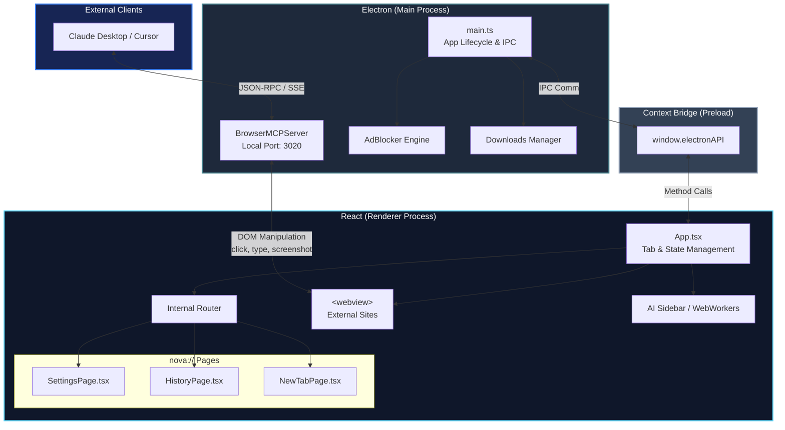

<div align="center">

  

  # 🚀 Nova Browser

  **A Next-Gen, AI-Native, Privacy-First Browser Built with Electron, React & Vite**

  [](https://react.dev/)
  [](https://www.electronjs.org/)
  [](https://www.typescriptlang.org/)
  [](https://vitejs.dev/)
  [](https://tailwindcss.com/)

  <p align="center">
    <a href="#-key-features">Key Features</a> •
    <a href="#-screenshots">Screenshots</a> •
    <a href="#-quick-start">Quick Start</a> •
    <a href="#-architecture">Architecture</a> •
    <a href="#-license">License</a>
  </p>

</div>

---

## 🌟 Overview

**Nova Browser** is an open-source, ultra-fast desktop web browser designed from the ground up for modern workflows. Featuring a glassmorphic aesthetic, native AI agent integration via **Model Context Protocol (MCP)**, full-page site-like internal interfaces (`nova://`), and a dual-view split-screen layout, Nova combines the performance of Chromium with the elegance of Arc and Chrome.

---

## 📸 Screenshots

<div align="center">
  
  <p><em>Main Browser View with Vertical Sidebar, Glassmorphic TopBar, and Active Webview</em></p>
  <br/>
  
  <p><em>Nova Start Page featuring Speed Dials, Omni Search & Interactive Tasks Widget</em></p>
</div>

---

## ✨ Key Features

### 🤖 AI Agent & Virtual Cursor (MCP Protocol)
- **Model Context Protocol (MCP)**: Native integration for AI assistants (Cursor, Claude Desktop, Antigravity) to navigate, read pages, click elements, fill forms, and capture screenshots.
- **Glowing AI Cursor Overlay**: Watch autonomous AI subagents interact with live webpages in real-time with an animated glowing cursor.

### 🌐 Site-Like Internal Pages (`nova://`)
- **`nova://settings`**: Complete browser preferences, theme toggles, search engine selection, and privacy controls.
- **`nova://history`**: Grouped timeline search, date filtering, and quick item deletion.
- **`nova://downloads`**: Live progress indicators, pause/resume, folder shortcuts, and file launching.
- **`nova://extensions`**: Install packed CRX extensions directly from the Chrome Web Store or load unpacked development add-ons.

### 🪟 Productivity & Multi-Tasking
- **Dual-View Split Screen**: Snap two active tabs side-by-side with a drag-to-resize divider.
- **Vertical Tabs & Workspaces**: Organize tabs into color-coded workspace groups with mute, pin, and duplicate actions.
- **Tasks & To-Do Widget**: Built-in glassmorphic checklist on the start page with custom check animations and task filtering.

### 🛡️ Security & Privacy
- **Privacy Shield**: Built-in AdBlocker and tracking protection powered by `@cliqz/adblocker-electron`.
- **Proxy VPN Support**: Toggle free proxy servers or custom VPN endpoints for encrypted browsing.
- **Incognito Mode**: Isolated session tabs that leave no trace in history or local storage.

---

## 🛠️ Tech Stack

- **Shell**: [Electron 33](https://www.electronjs.org/)
- **Frontend Framework**: [React 18](https://react.dev/) + [TypeScript](https://www.typescriptlang.org/)
- **Bundler & Build Tool**: [Vite 6](https://vitejs.dev/) + [esbuild](https://esbuild.github.io/)
- **Styling & Animations**: [TailwindCSS](https://tailwindcss.com/) + [Framer Motion](https://www.framer.com/motion/)
- **Icons**: [Lucide React](https://lucide.dev/)
- **AdBlock & Filtering**: [`@cliqz/adblocker-electron`](https://github.com/cliqz-oss/adblocker)

---

## 🚀 Quick Start

### Prerequisites
- [Node.js](https://nodejs.org/) (v18 or higher recommended)
- `npm` or `yarn`

### 1. Clone the repository
```bash
git clone https://github.com/unitybtw/nova-browser.git
cd open-source-browser
```

### 2. Install dependencies
```bash
npm install
```

### 3. Start development server
```bash
npm run dev
```

### 4. Build for production
```bash
npm run build
```

---

## 🏗️ Architecture

Nova Browser employs a modern Electron architecture with strict context isolation, a React-based renderer, and a dedicated AI integration layer via the Model Context Protocol (MCP).



### Component Breakdown
- **Main Process**: Handles native OS integration, window management, hardware acceleration, and runs the MCP Server to listen for AI client connections.
- **Preload Scripts**: Securely bridges communication between Node.js (`ipcMain`) and the React frontend (`ipcRenderer`) without exposing Node primitives to the DOM.
- **Renderer Process**: Built with React, Vite, and TailwindCSS. Manages the browser's UI layout, internal `nova://` protocol pages, and embeds external sites using Electron's secure `<webview>` tags.
- **MCP Bridge**: A built-in HTTP/SSE server that allows external LLMs to read the DOM, inject JavaScript, and autonomously navigate the browser.

---

## 🤖 MCP (Model Context Protocol) Setup Guide

Nova Browser natively supports the Model Context Protocol (MCP), allowing AI assistants to browse the web autonomously. 

To connect **Claude Desktop** to Nova Browser, add the following configuration to your `claude_desktop_config.json`:

```json
{
  "mcpServers": {
    "nova-browser": {
      "command": "node",
      "args": ["/ABSOLUTE_PATH_TO_YOUR_PROJECT/mcp-bridge.mjs"]
    }
  }
}
```
*Note: Make sure Nova Browser is running before using the Claude Desktop integration.*

---

## 🗺️ Roadmap

- [x] Basic Browser Engine (Tabs, Navigation, Webviews)
- [x] Native MCP AI Agent Integration
- [x] Glassmorphic UI & Productivity Tools (Workspaces, Tasks)
- [x] Built-in Privacy Shield (Adblocker)
- [ ] Direct Chrome Web Store Extension Installation
- [ ] Cross-Device Tab & History Synchronization
- [ ] Built-in Local LLM Support (Web-LLM)
- [ ] Mobile App Companion

---

## 🛡️ Security & Privacy

Nova Browser takes security seriously:
- **Strict Context Isolation**: The renderer process is completely isolated from Node.js primitives.
- **Sandboxed Webviews**: External sites are loaded in securely partitioned `<webview>` tags that prevent malicious code from escaping into the browser's main process.
- **Phishing Protection**: Built-in detection for known phishing URLs and domains.
- **Zero Telemetry**: We do not track your browsing history. Everything is stored locally on your machine.

---

## 🤝 Contributing

We welcome contributions from the community! To contribute:

1. Fork the repository
2. Create your feature branch (`git checkout -b feature/AmazingFeature`)
3. Commit your changes (`git commit -m 'Add some AmazingFeature'`)
4. Push to the branch (`git push origin feature/AmazingFeature`)
5. Open a Pull Request

---

## ❓ FAQ

**Q: Can I use Google Chrome Extensions?**
A: Yes! You can install packed `.crx` files directly via the `nova://extensions` page. Direct Chrome Web Store installations are on our roadmap.

**Q: Does Nova track my data?**
A: No. Nova is 100% privacy-focused. Your history, bookmarks, and passwords remain on your local disk.

**Q: Why does the AI cursor fail to click sometimes?**
A: Make sure you have the exact correct absolute path to `mcp-bridge.mjs` in your Claude configuration, and ensure that Nova Browser is actively running.

---

## 📄 License

Distributed under the MIT License. See `LICENSE` for more information.

---

<div align="center">
  <sub>Built with ❤️ by the Nova Browser Team</sub>
</div>