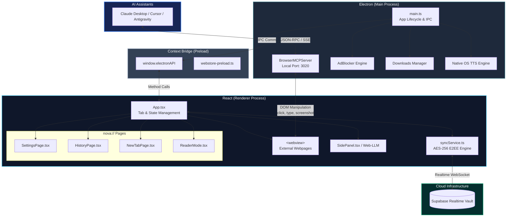

<div align="center">

  

  # 🚀 Nova Browser

  **The Next-Gen, AI-Native, Privacy-First Desktop Browser**  
  *Built with Electron, React, TypeScript & Vite — Featuring Zero-Knowledge Cloud Sync & Autonomous AI Agents*

  <br/>

  [](https://opensource.org/licenses/MIT)
  [](https://www.electronjs.org/)
  [](https://react.dev/)
  [](https://www.typescriptlang.org/)
  [](https://vitejs.dev/)
  [](https://tailwindcss.com/)
  [](https://github.com/unitybtw/nova-browser)

  <p align="center">
    <a href="#-key-features">Key Features</a> •
    <a href="#-nova-sync-zero-knowledge-cloud-sync">Nova Sync</a> •
    <a href="#-screenshots">Screenshots</a> •
    <a href="#-quick-start">Quick Start</a> •
    <a href="#-architecture">Architecture</a> •
    <a href="#-mcp-ai-agent-guide">AI & MCP</a> •
    <a href="#-security--privacy">Security</a>
  </p>

</div>

---

## 🌟 Overview

**Nova Browser** is an open-source, high-performance web browser engineered for modern power users, developers, and AI-driven workflows. Combining the speed and rendering engine of Chromium with a refined glassmorphic aesthetic, Nova introduces **native autonomous AI agents via the Model Context Protocol (MCP)**, **zero-knowledge end-to-end encrypted multi-device sync**, **1-click Chrome Web Store extension installs**, and a **dual-view split-screen layout**.

---

## 📸 Screenshots

<div align="center">
  
  <p><em>Nova Start Page & Dashboard: Vertical Sidebar, Omni Search, Quick Dials & Task Management</em></p>
  <br/>
  
  <p><em>Nova Sync: Zero-Knowledge 1-Click Multi-Device Pairing Code & Cloud Sync</em></p>
</div>

---

## ✨ Key Features

### 🔄 1-Click Nova Cloud Sync (Zero-Knowledge E2EE)
- **1-Click Device Pairing**: Pair laptops and desktops instantly using a human-friendly pairing code (`nova-xxxx-xxxx-xxxx-xxxx`). No email, passwords, or account registration needed.
- **End-to-End Encryption (AES-256-GCM)**: All saved passwords, bookmarks, browsing history, settings, and workspace arrangements are encrypted on your device with PBKDF2 (100,000 iterations) and 256-bit AES-GCM before being sent to the cloud.
- **Realtime WebSocket Sync**: Remote changes propagate seamlessly across your devices in real-time.

### 🤖 AI Agent & Virtual Cursor (MCP Protocol)
- **Model Context Protocol (MCP)**: Native integration for AI agents (Cursor, Claude Desktop, Antigravity) to navigate, read pages, click elements, fill forms, and take screenshots.
- **Glowing AI Cursor Overlay**: Watch autonomous AI subagents interact with live webpages in real-time with an animated glowing cursor.
- **Built-in Local AI Sidepanel**: Run lightweight local models offline directly in your browser using Web-LLM and WebGPU.

### 🧩 1-Click Chrome Web Store Extensions
- **Direct Web Store Installation**: Browse the official Chrome Web Store and install extensions with 1-click via the top banner.
- **Manual CRX / Unpacked Add-ons**: Load developer extensions or zip packages effortlessly through `nova://extensions`.

### 🌐 Native `nova://` Internal Pages
- **`nova://settings`**: Complete preferences, theme toggles, search engine picker, shortcuts, and sync controls.
- **`nova://history`**: Grouped timeline search, date filtering, and quick item deletion.
- **`nova://downloads`**: Live progress indicators, pause/resume, folder shortcuts, and file launching.
- **`nova://passwords`**: Zero-knowledge encrypted password vault with auto-fill and password generator.

### 🪟 Productivity & Multi-Tasking
- **Dual-View Split Screen**: Snap two active tabs side-by-side with a drag-to-resize divider.
- **Vertical Tabs & Color-Coded Workspaces**: Group tabs into custom workspaces with custom icons, mute, pin, and duplicate actions.
- **Tasks & To-Do Widget**: Built-in glassmorphic checklist on the start page with custom check animations and task filtering.
- **Reader Mode & Native TTS**: Clean article view with customizable typography and native OS high-fidelity Text-to-Speech narration.

### 🛡️ Security & Privacy First
- **Privacy Shield**: Built-in AdBlocker and tracking protection powered by `@cliqz/adblocker-electron`.
- **Proxy VPN Support**: Toggle proxy servers or custom VPN endpoints for encrypted browsing.
- **Incognito Mode**: Isolated session tabs that leave no trace in history or local storage.
- **Strict Context Isolation**: Process sandboxing, CSP headers, and DNS SSRF protections.

---

## 🛠️ Tech Stack

| Component | Technology |
|---|---|
| **Runtime Shell** | [Electron 33](https://www.electronjs.org/) |
| **Frontend Framework** | [React 18](https://react.dev/) + [TypeScript](https://www.typescriptlang.org/) |
| **Bundler & Build Tool** | [Vite 6](https://vitejs.dev/) + [esbuild](https://esbuild.github.io/) |
| **Styling & Motion** | [TailwindCSS 3](https://tailwindcss.com/) + [Framer Motion](https://www.framer.com/motion/) |
| **Icons** | [Lucide React](https://lucide.dev/) |
| **Cloud Sync & Realtime** | [Supabase](https://supabase.com/) + Web Crypto API (AES-GCM-256) |
| **AdBlock & Filtering** | [`@cliqz/adblocker-electron`](https://github.com/cliqz-oss/adblocker) |
| **AI Protocol** | [Model Context Protocol (MCP)](https://modelcontextprotocol.io/) |

---

## 🚀 Quick Start

### Prerequisites
- [Node.js](https://nodejs.org/) (v18 or higher recommended)
- `npm` or `yarn`

### 1. Clone the repository
```bash
git clone https://github.com/unitybtw/nova-browser.git
cd nova-browser
```

### 2. Install dependencies
```bash
npm install
```

### 3. Start development environment
```bash
npm run dev
```

### 4. Build for production
```bash
npm run build
```

---

## 🏗️ Architecture

Nova Browser employs a secure multi-process Electron architecture with strict context isolation, a React-based renderer, and a dedicated AI integration layer via the Model Context Protocol (MCP).



---

## 🤖 MCP (Model Context Protocol) Guide

Nova Browser natively exposes an MCP endpoint on port `3020`, enabling AI assistants to browse the web autonomously.

To connect **Claude Desktop** to Nova Browser, add this entry to your `claude_desktop_config.json`:

```json
{
  "mcpServers": {
    "nova-browser": {
      "command": "node",
      "args": ["/ABSOLUTE_PATH_TO_NOVA/mcp-bridge.mjs"]
    }
  }
}
```

---

## 🗺️ Completed Milestones & Roadmap

- [x] Modern Glassmorphic UI with Vertical Tabs & Workspaces
- [x] Native MCP Autonomous AI Agent Protocol & Virtual Glowing Cursor
- [x] Zero-Knowledge 1-Click Device Pairing Code Cloud Sync (E2EE)
- [x] Direct Chrome Web Store 1-Click Extension Installation
- [x] Built-in Privacy Shield (AdBlock & Tracker Protection)
- [x] Dual-View Split Screen with Drag-to-Resize Divider
- [x] Reader Mode with High-Fidelity Native OS Text-to-Speech (TTS)
- [x] Local Offline LLM Integration (Web-LLM / WebGPU)
- [ ] Mobile Companion Application

---

## 🛡️ Security & Privacy Commitment

- **Zero-Knowledge Architecture**: Encryption keys never leave your device. All passwords and confidential sync data are encrypted client-side with 256-bit AES-GCM.
- **Strict Context Isolation & Sandboxing**: Renderer code has no direct access to Node.js APIs or disk.
- **Zero Telemetry**: We do not collect, store, or monetize your browsing history.

---

## 🤝 Contributing

Contributions are welcome! Feel free to submit a Pull Request or open an Issue on GitHub:

1. Fork the repository
2. Create your branch: `git checkout -b feature/awesome-feature`
3. Commit your changes: `git commit -m "feat: add awesome feature"`
4. Push to branch: `git push origin feature/awesome-feature`
5. Open a Pull Request

---

## 📄 License

Distributed under the **MIT License**. See `LICENSE` for details.

<br/>

<div align="center">
  <sub>Designed & Developed with ❤️ by the Nova Browser Team</sub>
</div>