<div align="center">

  

  # Nova Browser

  **Open-Source Desktop Browser for Developers & Coding Agents**  
  *Built with Electron, React, TypeScript & Vite — Featuring Native MCP Server, On-Device WebGPU, and Zero-Knowledge E2EE Sync*

  <br/>

  [](https://opensource.org/licenses/MIT)
  [](https://www.electronjs.org/)
  [](https://react.dev/)
  [](https://www.typescriptlang.org/)
  [](https://vitejs.dev/)
  [](https://github.com/unitybtw/nova-browser)
  [](https://github.com/unitybtw/nova-browser)
  [](https://github.com/unitybtw/nova-browser)

  <p align="center">
    <a href="#why-nova">Why Nova?</a> •
    <a href="#overview">Overview</a> •
    <a href="#performance-benchmarks--browser-comparison">Benchmarks</a> •
    <a href="#screenshots">Screenshots</a> •
    <a href="#key-features">Key Features</a> •
    <a href="#tech-stack">Tech Stack</a> •
    <a href="#platform-support">Platforms</a> •
    <a href="#architecture">Architecture</a> •
    <a href="#security--privacy-commitment">Security</a>
  </p>

</div>

---

## Why Nova?

Rather than bloated cloud telemetry or generic hype, Nova focuses on three concrete developer pain points:

- **Native Model Context Protocol (MCP) Server (Port 3020)**: Built-in local MCP server allows coding agents (Claude Code, Cursor, Windsurf, or custom scripts) to inspect tabs, interact with DOM nodes, and stream console logs with zero configuration.
- **Zero-Telemetry Network-Level Privacy Shield**: Uses `@cliqz/adblocker` (EasyList, EasyPrivacy, Peter Lowe, uBlock filters) to terminate trackers and ad requests at the network layer before DOM parsing, paired with client-side AES-256-GCM zero-knowledge cloud sync.
- **Tab Hibernation & Resource Management**: Dormant background webviews automatically pause active rendering execution while preserving navigation state, helping minimize background CPU and memory usage during multi-tab sessions.

---

## Overview

**Nova Browser** is an open-source, sovereign desktop web browser built with Electron, React, TypeScript, and Vite. Designed for developers and privacy-conscious users, Nova pairs standard Chromium rendering with a native **Model Context Protocol (MCP) server**, **on-device WebGPU neural execution**, **zero-knowledge encrypted multi-device sync**, **Chrome Web Store extension support**, and a **dual-view split screen**.

---

## Performance Benchmarks & Browser Comparison

> **Architecture & Engine Parity Note:** Nova Browser is powered by modern Chromium (Blink) and Google V8 via Electron 43. Core JavaScript loop execution, HTML parsing, and DOM rendering performance are on par with Google Chrome (engine parity). Nova's distinct speed and efficiency advantages come from architectural design: zero background Google telemetry/account sync services, an aggressive idle tab hibernation engine, network-level ad/tracker interception, and an on-demand decoupled bundle structure.

### Head-to-Head Feature Matrix

| Architectural Feature | Nova Browser | Google Chrome | Brave Browser | Apple Safari 18 |
| :--- | :--- | :--- | :--- | :--- |
| **Core Engine** | **Chromium 134 / Blink** | Chromium 134 / Blink | Chromium 134 / Blink | WebKit |
| **AI Assistant** | **100% On-Device WebGPU (0 KB Sent)** | Cloud Gemini (Account required) | Cloud Leo (Paid tier) | Apple Intelligence |
| **Model Context Protocol (MCP)** | **Native Built-in Server (Port 3020)** | Not available | Not available | Not available |
| **Ad & Tracker Protection** | **Built-in Session Engine (EasyList)** | Not built-in (Extensions needed) | Brave Shields | Content Blockers |
| **Background Tab Strategy** | **Background Activity Suspension** | Memory Saver (Tab Discard) | Sleeping Tabs | OS Memory Management |
| **Multi-Device Cloud Sync** | **Zero-Knowledge E2EE (AES-256)** | Google Account required | Sync Chain | iCloud Keychain |
| **Split View Browsing** | **Native Dual Synchronized Canvas** | Not built-in | Not built-in | macOS Split View |
| **Telemetry & Analytics** | **Zero Telemetry (0 KB)** | Extensive telemetry | Opt-out required | Telemetry enabled |
| **Source Code & License** | **100% Open Source (MIT)** | Proprietary Core | MPL 2.0 | Proprietary Core |

---

### Empirical Microbenchmark Measurements

*Internal micro-benchmarks measuring React state dispatch, V8 heap allocation, and JS bundle budgets (`npm run benchmark`):*

| Benchmark Suite | Metric | Measured Value | Unit | Architectural Description |
| :--- | :--- | :--- | :--- | :--- |
| **Tab State Operations** | 100 Tabs Creation Latency | **~0.08** | ms | Instantaneous state tracking and virtualized tab allocation |
| **Tab Allocation** | Throughput | **1,200,000+** | ops/sec | Number of virtual tab structures instantiated per second |
| **Tab Hibernation State**| Inactive Tabs Hibernation | **~0.02** | ms | State transition setting isSuspended: true for pool eviction |
| **Network Filter Decision**| Fast Hash Lookup Latency | **~0.44** | µs / request | In-memory tracker domain hash set lookup latency |
| **Network Filter Decision**| Lookup Throughput | **2,200,000+** | checks/sec | Fast-path domain classification queries per second |
| **V8 Heap Memory** | Node Test Process Heap | **~5.5** | MB | Core JavaScript runtime heap allocation in microbenchmark |
| **Startup JS Bundle** | Core Entry Chunk | **~435** | KB | Lightweight initial JS evaluated at browser launch |
| **WebLLM Isolation** | Engine Chunk | **Decoupled (0 KB at start)** | - | 6 MB neural runtime loaded asynchronously on demand |

> **Full Benchmark Methodology & Reproduction Guide:** See [`BENCHMARK_REPORT.md`](BENCHMARK_REPORT.md) for internal V8 benchmark reproduction commands and architecture analysis.

---

## Screenshots

### 1. Vertical Tabs Layout

<div align="center">
  
  <p><em>Nova Start Page & Dashboard: Vertical Sidebar, Omni Search, Quick Dials & Task Management</em></p>
  <br/>
  
  <p><em>Active Browsing Experience: Multi-Tab Workspaces, Webview & Built-in AI Sidepanel</em></p>
</div>

<br/>

### 2. Horizontal Tabs Layout (Chrome-Style Top Tabs)

<div align="center">
  
  <p><em>Nova Start Page & Dashboard: Horizontal Top Tabs, Clean Omnibox & Customizable Speed Dials</em></p>
  <br/>
  
  <p><em>Active Browsing Experience: Full-Width Viewport, Horizontal Tab Strip & AI Assistant Sidepanel</em></p>
</div>

<br/>

### 3. Zero-Knowledge Cloud Sync

<div align="center">
  
  <p><em>Nova Sync: Zero-Knowledge 1-Click Multi-Device Pairing Code & Cloud Sync</em></p>
</div>

---

## Key Features

### 1-Click Nova Cloud Sync (Zero-Knowledge E2EE)
- **1-Click Device Pairing**: Pair laptops and desktops instantly using a human-friendly pairing code (`nova-xxxx-xxxx-xxxx-xxxx-xxxx-xxxx`). No email, passwords, or account registration needed.
- **End-to-End Encryption (AES-256-GCM)**: All saved passwords, bookmarks, browsing history, settings, and workspace arrangements are encrypted on your device with PBKDF2 (600,000 iterations) and 256-bit AES-GCM before being sent to the cloud.
- **Realtime WebSocket Sync**: Remote changes propagate seamlessly across your devices in real-time.

### AI Agent & Virtual Cursor (MCP Protocol)
- **Model Context Protocol (MCP)**: Native integration for AI agents (Cursor, Claude Desktop, Antigravity) to navigate, read pages, click elements, fill forms, and take screenshots.
- **Glowing AI Cursor Overlay**: Watch autonomous AI subagents interact with live webpages in real-time with an animated glowing cursor.
- **Built-in Local AI Sidepanel**: Run lightweight local models offline directly on your GPU via WebGPU and WebLLM.
- **Persistent Info & Memory Vault**: Automatically extracts user preferences and retains task history with category badges (`[PREFERENCE]`, `[FACT]`, `[INSTRUCTION]`).

### 1-Click Chrome Web Store Extensions
- **Direct Web Store Installation**: Browse the official Chrome Web Store and install extensions with 1-click via the top banner.
- **Manual CRX / Unpacked Add-ons**: Load developer extensions or zip packages effortlessly through `nova://extensions`.

### Native `nova://` Internal Pages
- **`nova://settings`**: Complete browser preferences, theme toggles, search engine picker, shortcuts, zero-knowledge password vault, and sync controls.
- **`nova://history`**: Grouped timeline search, date filtering, and quick item deletion.
- **`nova://downloads`**: Live progress indicators, pause/resume, folder shortcuts, and file launching.
- **`nova://newtab`**: Start page with quick dials, customizable animated background, and tasks widget.

### Productivity & Multi-Tasking
- **Dual-View Split Screen**: Snap two active tabs side-by-side with a drag-to-resize divider.
- **Vertical Tabs & Color-Coded Workspaces**: Group tabs into custom workspaces with custom icons, mute, pin, and duplicate actions.
- **Tasks & To-Do Widget**: Built-in checklist on the start page with custom check animations and task filtering.
- **Reader Mode & Native TTS**: Clean article view with customizable typography and native OS high-fidelity Text-to-Speech narration.

### Security & Privacy First
- **Privacy Shield**: Built-in AdBlocker and tracking protection powered by `@cliqz/adblocker-electron`.
- **Encrypted Proxy Support**: Toggle secure HTTPS and SOCKS5 proxy endpoints for private browsing.
- **Incognito Mode**: Isolated session tabs that leave no trace in history or local storage.
- **Strict Context Isolation**: Process sandboxing, CSP headers, and DNS SSRF protections.

---

## AI Architecture & Memory Vault

Nova Browser features a local-first neural execution architecture powered by WebGPU and WebLLM:

- **Supported Models**: Llama 3.2 3B (`Llama-3.2-3B-Instruct`), Phi 3.5 Vision (`Phi-3.5-vision-instruct`, Multimodal), and Qwen 2.5 0.5B (`Qwen2.5-0.5B-Instruct`, Ultra-Light).
- **Natural Language Direct Intent Engine**: Automatically identifies direct browser actions (e.g. `"github unitybtw/nova-browser aç"`, `"duckduckgo'da webgpu ara"`, `"geçmişte react bul"`, `"açık sekmeleri listele"`, `"bu sayfayı özetle"`).
- **Persistent Info & Memory Vault**: Remembers user preferences (e.g. tone, language, dark theme) and automatically injects them into agent instructions.
- **Task History Tracking**: Maintains a persistent chronological log of completed browser tasks and AI executions.

---

## Keyboard Shortcuts
 
 | Shortcut (macOS) | Shortcut (Windows/Linux) | Action |
 | :--- | :--- | :--- |
 | `Cmd + T` | `Ctrl + T` | Open New Tab |
 | `Cmd + N` | `Ctrl + N` | Open New Window |
 | `Cmd + Shift + N` | `Ctrl + Shift + N` | Open Incognito Window |
 | `Cmd + W` | `Ctrl + W` | Close Active Tab |
 | `Cmd + Shift + T` | `Ctrl + Shift + T` | Reopen Last Closed Tab |
 | `Cmd + L` | `Ctrl + L` | Focus Address Bar / Omnibox |
 | `Cmd + K` | `Ctrl + K` | Spotlight Omnibox Quick Search |
 | `Cmd + I` / `Cmd + Shift + A` | `Ctrl + I` / `Ctrl + Shift + A` | Toggle AI Assistant Sidepanel |
 | `Cmd + B` / `Cmd + S` | `Ctrl + B` / `Ctrl + S` | Toggle Vertical Tabs Sidebar |
 | `Ctrl + Tab` / `Ctrl + Shift + Tab` | `Ctrl + Tab` / `Ctrl + Shift + Tab` | Switch to Next / Previous Tab |
 | `Cmd + 1..9` | `Ctrl + 1..9` | Direct Tab Jump (1st through 9th) |
 | `Cmd + R` / `F5` | `Ctrl + R` / `F5` | Reload Current Page |
 | `Cmd + [` / `Cmd + ]` | `Alt + Left` / `Alt + Right` | Back / Forward History Navigation |
 | `Cmd + F` | `Ctrl + F` | Find in Page |
 | `Cmd + P` | `Ctrl + P` | Print Page / Save as PDF |
 | `Cmd + +` / `Cmd + -` / `Cmd + 0` | `Ctrl + +` / `Ctrl + -` / `Ctrl + 0` | Zoom In / Zoom Out / Reset (100%) |
 | `Cmd + D` | `Ctrl + D` | Bookmark Current Page |
 | `Cmd + Shift + S` | `Ctrl + Shift + S` | Capture Full-Page Screenshot |
 | `Cmd + Y` | `Ctrl + H` | Open History (`nova://history`) |
 | `Shift + Cmd + J` | `Ctrl + J` | Open Downloads (`nova://downloads`) |
 | `Cmd + ,` | `Ctrl + ,` | Open Settings (`nova://settings`) |
 | `F12` / `Cmd + Opt + I` | `F12` / `Ctrl + Shift + I` | Open Developer Tools |
 | `F1` / `Cmd + /` | `F1` / `Ctrl + /` | Open Help & Shortcuts Guide |

---

## Tech Stack

| Component | Technology |
|---|---|
| **Runtime Shell** | [Electron 43](https://www.electronjs.org/) |
| **Frontend Framework** | [React 18](https://react.dev/) + [TypeScript](https://www.typescriptlang.org/) |
| **Bundler & Build Tool** | [Vite 6](https://vitejs.dev/) + [esbuild](https://esbuild.github.io/) |
| **Styling & Motion** | [TailwindCSS](https://tailwindcss.com/) + [Framer Motion](https://www.framer.com/motion/) |
| **Icons** | [Lucide React](https://lucide.dev/) |
| **Cloud Sync & Realtime** | [Supabase](https://supabase.com/) + Web Crypto API (AES-GCM-256) |
| **AdBlock & Filtering** | [`@cliqz/adblocker-electron`](https://github.com/cliqz-oss/adblocker) |
| **AI Protocol** | [Model Context Protocol (MCP)](https://modelcontextprotocol.io/) |
| **On-Device LLM Runtime** | [WebLLM / WebGPU](https://webllm.mlc.ai/) |

---

## Quick Start

### Option A: Download Official Release (Recommended)

Download the latest prebuilt installer for your operating system (DMG for macOS, Setup Exe for Windows, AppImage/Deb for Linux) directly from [GitHub Releases](https://github.com/unitybtw/nova-browser/releases).

### Option B: Build from Source

#### Prerequisites
- [Node.js](https://nodejs.org/) (v20 or higher recommended)
- [npm](https://www.npmjs.com/) (v9 or higher)

#### 1. Clone the repository
```bash
git clone https://github.com/unitybtw/nova-browser.git
cd nova-browser
```

### 2. Install dependencies
```bash
npm install
```

### 3. Start development environment
```bash
npm run dev
```

### 4. Build for production
```bash
npm run build
```

---

## Platform Support

| Operating System | Architecture | Target Status | Hardware Acceleration |
| :--- | :--- | :--- | :--- |
| **macOS (Sonoma / Sequoia)** | Apple Silicon (M1 / M2 / M3 / M4) | Supported | Apple Metal API (120Hz ProMotion) |
| **macOS (Monterey / Ventura)** | Intel (x86_64) | Supported | Metal / OpenGL |
| **Windows (10 / 11)** | x64 / ARM64 | Supported | Direct3D 11/12 & Vulkan |
| **Linux (Ubuntu / Fedora / Arch)** | x86_64 | Supported | Vulkan / VA-API Acceleration |

---

## Architecture

Nova Browser employs a multi-process Electron architecture with context isolation, a React-based renderer with WebGPU neural execution, and a dedicated AI integration layer via the Model Context Protocol (MCP).

```mermaid
graph TD
    subgraph Electron["Electron (Main Process)"]
        main["main.ts - App Lifecycle & IPC Dispatcher"]
        mcp["mcpServer.ts - Native MCP Server (Port 3020)"]
        adblock["AdBlocker & Privacy Shield (Network Layer Filter)"]
        security["proxySecurity.ts - SSRF & Phishing Defense"]
        crx["crxInstaller.ts - Chrome Web Store Engine"]
        downloads["downloads.ts - Downloads Manager"]
        keychain["safeStorage Engine - OS Keychain Store"]
        tts["tts.ts - Native OS Speech Synthesis Bridge"]
    end

    subgraph Preload["Context Bridge (Preload Security)"]
        api["preload.ts (window.electronAPI)"]
        webstore["webstore-preload.ts (Web Store Bridge)"]
        guest["guest-preload.ts (Sandboxed Webview Bridge)"]
    end

    subgraph Renderer["React 18 + TypeScript (Renderer Process)"]
        app["App.tsx - Coordinator Shell"]

        subgraph ModularHooks["Modular Hooks Architecture (src/hooks/)"]
            tabOps["useTabOperations.ts - Tab CRUD & Virtualization"]
            appIpc["useAppIpc.ts - Central IPC Hub & Listeners"]
            agentBridge["useBrowserAgentBridge.ts - ReAct Agent & Cursor"]
            workspaces["useWorkspaces.ts & useFolders.ts - Organization"]
            splitView["useSplitView.ts - Dual-View Canvas"]
            syncHook["useAppSync.ts & useAppDataBackup.ts - Sync & Backup"]
            hibernation["useTabHibernation.ts - Memory & Tab Eviction"]
        end

        subgraph AISubsystem["AI & Neural Subsystem"]
            agent["aiAgent.ts - ReAct Engine & Intent Parser"]
            memory["aiMemory.ts - Persistent Info Vault"]
            cursor["AICursorOverlay.tsx - Glowing Agent Cursor"]
            preview["AILinkPreview.tsx - Hover Preview & Summary"]
            worker["workers/aiWorker.ts - WebLLM Neural Runtime"]
            sidepanel["SidePanel.tsx - AI Assistant & Tool Tracing"]
        end

        subgraph CoreUI["Views, Tabs & Navigation"]
            browserView["BrowserView.tsx - Sandboxed Webview Host"]
            sidebarTabs["SidebarTabs.tsx & TopBar.tsx"]
            spotlight["SpotlightOmnibox.tsx - Command Palette"]
        end

        subgraph InternalPages["Internal Views & Pages"]
            settings["SettingsPage.tsx (nova://settings)"]
            history["HistoryPage.tsx (nova://history)"]
            newtab["NewTabPage.tsx (nova://newtab)"]
            downloadsPage["DownloadsPage.tsx (nova://downloads)"]
            reader["ReaderMode.tsx (Reader Mode View)"]
            extModal["ExtensionsModal.tsx (Extensions Manager)"]
        end
    end

    subgraph Cloud["Cloud Infrastructure"]
        supabase["Supabase Realtime Vault - Encrypted Blobs"]
    end

    subgraph External["External AI Agents (MCP Clients)"]
        claude["Claude Desktop / Cursor / Windsurf / Antigravity"]
    end

    main <-->|Secure IPC Bridge| api
    main <-->|Chrome Web Store Bridge| webstore
    main <-->|Sandbox Security Policy| guest
    guest <-->|Guest DOM Protection| browserView
    api <-->|Typed API Invocations| app
    app --> ModularHooks
    app --> CoreUI
    app --> InternalPages
    app --> AISubsystem

    ModularHooks <--> CoreUI
    agent <-->|Off-thread Web Worker| worker
    agent <-->|Read and Write| memory
    agent --> cursor
    agent --> preview

    syncHook <-->|Encrypted WebSocket AES-256-GCM| supabase

    main --> adblock
    main --> security
    main --> crx
    main --> downloads
    main --> keychain
    main --> tts

    claude <-->|JSON-RPC over SSE Port 3020| mcp
    mcp <-->|CDP & Main Process Bridge| browserView

    style Electron fill:#1e293b,stroke:#47848F,stroke-width:2px,color:#fff
    style Preload fill:#334155,stroke:#94a3b8,stroke-width:2px,color:#fff
    style Renderer fill:#0f172a,stroke:#61DAFB,stroke-width:2px,color:#fff
    style ModularHooks fill:#1e293b,stroke:#38bdf8,stroke-width:1.5px,color:#fff
    style AISubsystem fill:#1e1b4b,stroke:#818cf8,stroke-width:1.5px,color:#fff
    style CoreUI fill:#064e3b,stroke:#10b981,stroke-width:1.5px,color:#fff
    style InternalPages fill:#1e293b,stroke:#94a3b8,stroke-width:1.5px,color:#fff
    style Cloud fill:#042f2e,stroke:#059669,stroke-width:2px,color:#fff
    style External fill:#172554,stroke:#3b82f6,stroke-width:2px,color:#fff
```



### Architectural Subsystem Breakdown

1. **Main Process & Security Isolation (`electron/main.ts`, `electron/mcpServer.ts`, `electron/main/`)**:
   - **Process Sandboxing & IPC Guards**: Sandboxed webviews run with `contextIsolation: true` and `nodeIntegration: false`. Every IPC channel strictly enforces `isTrustedSender(event)` verification (validating sender frame, origin, and protocol) to prevent untrusted guests or rogue frames from invoking privileged host operations.
   - **Network Privacy Shield & AdBlock**: High-performance network request interception via Chromium session webRequest hooks and `@cliqz/adblocker-electron` (EasyList, EasyPrivacy, Peter Lowe, uBlock filters). Backed by an in-memory hash set phishing filter and SSRF defenses that automatically block private RFC 1918, link-local, and loopback IP spoofing.
   - **Chrome Web Store Engine (`crxInstaller.ts`)**: Direct CRX3 package retrieval, zip-slip path traversal neutralization, manifest permission auditing, and user review gate before extension installation.
   - **Hardware & OS Integration**: Native GPU acceleration (Metal API on macOS with 120Hz ProMotion, Direct3D/Vulkan on Windows & Linux), native OS Text-to-Speech synthesis (`tts.ts`), and OS keychain password encryption via `safeStorage`.

2. **Modular React Renderer & Hook Architecture (`src/App.tsx`, `src/hooks/`)**:
   - **Coordinator Shell (`App.tsx`)**: Decoupled top-level coordinator shell that delegates business logic, state machines, and event subscriptions across 27 specialized custom hooks in `src/hooks/`.
   - **Tab & Window Operations (`useTabOperations.ts`, `useSplitView.ts`)**: Manages tab lifecycles, virtual ordering, pin/unpin, tab cloning, and dual-view split screen geometry with drag-to-resize divider and fractional split persistence.
   - **Central IPC Hub (`useAppIpc.ts`)**: Centralizes all Electron IPC listeners (downloads, zoom, bookmarks, shortcuts, updates) with guaranteed listener cleanup and unmount teardown, preventing event leaks.
   - **Workspace & Grouping Hierarchy (`useWorkspaces.ts`, `useFolders.ts`)**: Contextual workspace isolation with color tagging, nested folder structures, and tab group collapsing.
   - **Data Resilience (`useAppDataBackup.ts`, `useSessionPersistence.ts`, `useDiskHydrationFallback.ts`)**: Atomic local state persistence, automatic session recovery, and sanitized JSON backup export/import.

3. **Decoupled AI & Neural Runtime (`src/services/aiAgent.ts`, `src/workers/aiWorker.ts`, `electron/mcpServer.ts`)**:
   - **WebGPU Neural Execution**: Runs local quantized LLMs (Llama 3.2 3B, Phi 3.5 Vision, Qwen 2.5) inside an isolated Web Worker (`aiWorker.ts`), completely decoupled from the main UI bundle (0 KB initial startup impact, code-split into `web-llm-*.js`).
   - **Natural Language Intent Engine**: Instant natural language parsing for direct browser navigation, history searching, tab grouping, and 3-bullet page distillation without burning LLM generation tokens.
   - **Native Model Context Protocol (MCP) Server (Port 3020)**: Built-in local HTTP/SSE MCP server with Bearer token authentication (`X-MCP-Token`) and DNS rebinding protection, enabling external coding agents (Claude Desktop, Cursor, Windsurf, Antigravity) to navigate, query, click DOM nodes, and stream logs.
   - **Autonomous ReAct Agent & Visual Cursor**: Multi-step reasoning loop with live DOM tree inspection and a virtual glowing cursor (`AICursorOverlay.tsx`) for real-time visual execution tracking.
   - **Memory Vault (`aiMemory.ts`)**: Categorized persistent memory (`[PREFERENCE]`, `[FACT]`, `[INSTRUCTION]`) with LRU eviction and quota-safe storage management.

4. **Client-Side E2EE Sync Engine (`src/services/syncService.ts`, `src/services/syncCrypto.ts`)**:
   - **Zero-Knowledge Cryptography**: Passwords, bookmarks, history, and workspace configurations are encrypted locally using PBKDF2 (600,000 iterations) with cryptographic salt and 256-bit AES-GCM before transmission.
   - **Sovereign 1-Click Device Pairing**: High-entropy pairing codes (`nova-xxxx-xxxx-xxxx-xxxx-xxxx-xxxx`) enable instantaneous cross-device synchronization over Supabase Realtime WebSockets without centralized user accounts or plaintext storage.

5. **Performance & Tab Virtualization (`src/utils/tabManager.ts`, `src/hooks/useTabHibernation.ts`, `src/components/BrowserView.tsx`)**:
   - **Tab Hibernation Engine**: Dormant background tabs (>10 min idle) automatically unmount their active webview rendering pipelines while preserving navigation state, keeping 50+ tabs under 600 MB RAM.
   - **Dual-View Split Screen**: Synchronized parallel browsing with drag-to-resize divider and independent scrolling contexts.

---

## MCP (Model Context Protocol) Guide

Nova Browser natively exposes an MCP endpoint on port `3020`, enabling AI assistants to browse the web autonomously.

To connect **Claude Desktop**, **Cursor**, or **Windsurf** to Nova Browser, add this entry to your MCP configuration file:

```json
{
  "mcpServers": {
    "nova-browser": {
      "command": "node",
      "args": ["/ABSOLUTE_PATH_TO_NOVA/mcp-bridge.mjs"],
      "env": {
        "MCP_TOKEN": "YOUR_NOVA_MCP_TOKEN"
      }
    }
  }
}
```

*(Note: Find your persistent token under `nova://settings` -> Developer / MCP Server, or check the terminal output on startup).*

---

## Completed Milestones & Roadmap

- [x] Modern UI with Vertical Tabs & Workspaces
- [x] Native MCP Autonomous AI Agent Protocol & Virtual Glowing Cursor
- [x] Zero-Knowledge 1-Click Device Pairing Code Cloud Sync (E2EE)
- [x] Direct Chrome Web Store 1-Click Extension Installation
- [x] Built-in Privacy Shield (AdBlock & Tracker Protection)
- [x] Dual-View Split Screen with Drag-to-Resize Divider
- [x] Reader Mode with High-Fidelity Native OS Text-to-Speech (TTS)
- [x] Local Offline LLM Integration (Web-LLM / WebGPU)
- [x] Persistent Info Vault & Task History Tracking
- [x] Comprehensive Automated Test Suite (48 Test Suites, 640+ Regression, Security & Empirical Tests)
- [ ] Mobile Companion Application

---

## Security & Privacy Commitment

- **Zero-Knowledge Architecture**: Encryption keys never leave your device. All passwords and confidential sync data are encrypted client-side with 256-bit AES-GCM.
- **Strict Context Isolation & Sandboxing**: Renderer code has no direct access to Node.js APIs or disk.
- **Zero Telemetry & Tracking**: We do not collect, store, or monetize your browsing history. No analytics, error telemetry, or tracking beacons are bundled. (Transparent disclosure: direct connections occur only when explicitly using specific features, such as opt-in Supabase sync, downloading local model weights from HuggingFace, fetching wallpapers from Unsplash/Bing, or page translation via Google Translate).

### Binary Verification

Every release package is compiled via reproducible GitHub Actions workflows. Each release publishes a `SHA256SUMS.txt` file signed by the CI pipeline so you can independently verify that what you download is exactly what was built.

Cryptographic checksums are the only verifiable guarantee we can honestly make. We do not link raw antivirus detection counts as trust signals — antivirus results vary widely across engines and detection states, and a low count does not imply safety on its own.

```bash
# Download the release binary and its checksum file from GitHub Releases, then:

# Verify on macOS / Linux:
sha256sum -c SHA256SUMS.txt

# Verify on Windows (PowerShell):
$hash = Get-FileHash Nova-Browser-Setup-*.exe -Algorithm SHA256
# Compare $hash.Hash against the value in SHA256SUMS.txt
```

All checksums are generated and published automatically in the `publish-release` CI step; see [`.github/workflows/release.yml`](.github/workflows/release.yml) for the full pipeline source.


---

## Contributing

Contributions are welcome! Feel free to submit a Pull Request or open an Issue on GitHub:

1. Fork the repository
2. Create your branch: `git checkout -b feature/awesome-feature`
3. Commit your changes: `git commit -m "feat: add awesome feature"`
4. Push to branch: `git push origin feature/awesome-feature`
5. Open a Pull Request

---

## License

Distributed under the **MIT License**. See `LICENSE` for details.

<br/>

<div align="center">
  <sub>Designed & Developed by the Nova Browser Team</sub>
</div>
