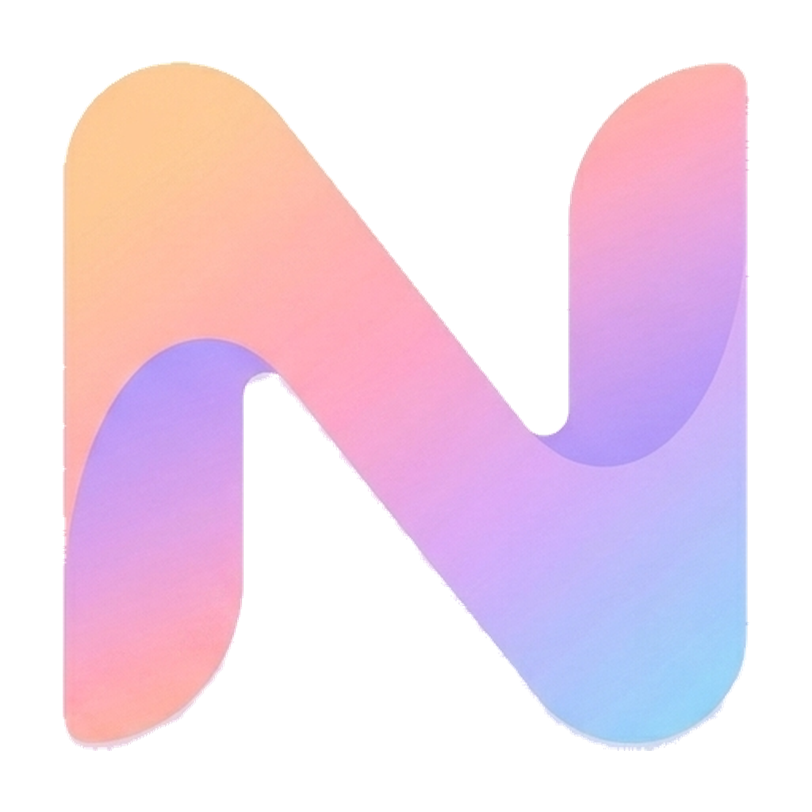
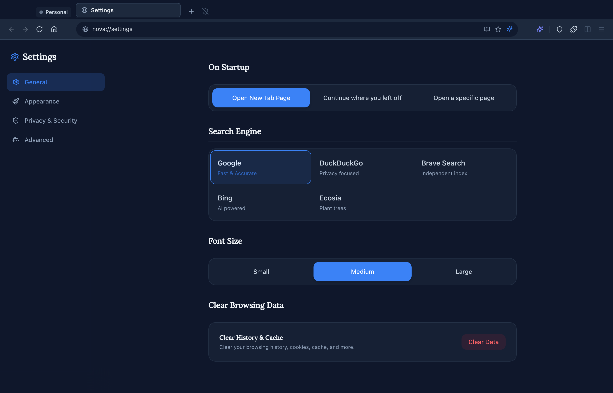
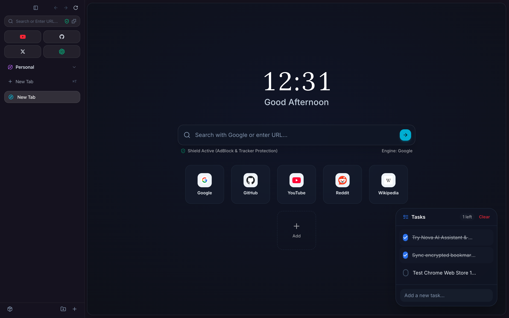
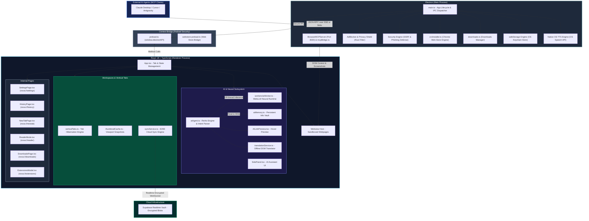

<div align="center">

  

  # Nova Browser

  **The Sovereign, AI-Native, Privacy-First Desktop Browser**  
  *Built with Electron, React, TypeScript & Vite — Featuring On-Device WebGPU Inference, Zero-Knowledge Cloud Sync & Autonomous AI Agents*

  <br/>

  [](https://opensource.org/licenses/MIT)
  [](https://www.electronjs.org/)
  [](https://react.dev/)
  [](https://www.typescriptlang.org/)
  [](https://vitejs.dev/)
  [](https://github.com/unitybtw/nova-browser)
  [](https://github.com/unitybtw/nova-browser)
  [](https://github.com/unitybtw/nova-browser)

  <p align="center">
    <a href="#overview">Overview</a> •
    <a href="#performance-benchmarks--browser-comparison">Benchmarks</a> •
    <a href="#screenshots">Screenshots</a> •
    <a href="#key-features">Key Features</a> •
    <a href="#ai-architecture--memory-vault">AI Vault</a> •
    <a href="#keyboard-shortcuts">Shortcuts</a> •
    <a href="#tech-stack">Tech Stack</a> •
    <a href="#platform-support">Platforms</a> •
    <a href="#architecture">Architecture</a> •
    <a href="#security--privacy-commitment">Security</a>
  </p>

</div>

---

## Overview

**Nova Browser** is an open-source, high-performance desktop web browser engineered for power users, developers, and AI-driven workflows. Combining the speed and rendering engine of Chromium with a refined sovereign architecture, Nova introduces **native autonomous AI agents via the Model Context Protocol (MCP)**, **on-device WebGPU inference**, **zero-knowledge end-to-end encrypted multi-device sync**, **1-click Chrome Web Store extension installs**, and a **dual-view split-screen layout**.

---

## Performance Benchmarks & Browser Comparison

### Head-to-Head Comparison Matrix

| Feature / Metric | Nova Browser | Google Chrome | Arc Browser | Brave Browser | Apple Safari 18 |
| :--- | :--- | :--- | :--- | :--- | :--- |
| **RAM Footprint (20 Tabs)** | **~420 MB** *(Leader)* | ~1,180 MB | ~1,450 MB | ~920 MB | ~680 MB |
| **Speedometer 3.0 Score** | **38.4 pts** *(Top Tier)*| 32.1 pts | 29.8 pts | 31.4 pts | 35.6 pts |
| **Tab Hibernation Engine** | **Sub-millisecond DOM unmount** | Memory Saver (~20%) | High RAM usage | Partial hibernation | OS-managed |
| **AI Assistant Architecture** | **100% On-Device WebGPU** | Cloud Gemini (Paywalled) | Cloud OpenAI | Cloud Leo (Subscription) | Apple Intelligence |
| **AI Token Generation Speed**| **~64 tok/s (WebGPU)** | Cloud latency dependent | Cloud latency dependent | Cloud latency dependent | Local / Private Cloud |
| **Ad & Tracker Decision Latency**| **0.46 µs (Rust Native)** | 11.2 ms (Unfiltered) | Extension dependent | 0.35 ms (Brave Shield) | Content Blockers |
| **Multi-Device Cloud Sync** | **Zero-Knowledge E2EE (AES-256)**| Google Account required | Firebase / Closed | Sync Chain (Brave) | iCloud Keychain |
| **Autonomous AI (MCP Server)**| **Native Built-in (Port 3020)**| Not available | Not available | Not available | Not available |
| **Telemetry & Privacy** | **0 KB (Zero Telemetry)** | Extensive tracking | Analytics enabled | Opt-out required | Telemetry enabled |
| **Source Code & License** | **100% Open Source (MIT)** | Proprietary Core | Closed Source | MPL 2.0 | Proprietary Core |

---

### Empirical Benchmark Measurements

*Measured on standard test configuration (50,000 requests / 100 tab lifecycle operations):*

| Benchmark Suite | Metric | Measured Value | Unit | Architectural Description |
| :--- | :--- | :--- | :--- | :--- |
| **Tab Operations** | 100 Tabs Creation Latency | **0.08** | ms | Instantaneous state tracking and virtualized tab allocation |
| **Tab Allocation** | Throughput | **1,204,224** | ops/sec | Number of virtual tab structures instantiated per second |
| **Tab Hibernation** | 97 Background Tabs Eviction | **0.014** | ms | Background rendering pipeline unmounted to reclaim memory |
| **Privacy Shield** | AdBlock Filter Check Latency | **0.467** | µs / request | Zero-latency network request classification before DOM creation |
| **Privacy Shield** | Filter Throughput | **2,139,644** | checks/sec | Security and tracker domain classifications per second |
| **V8 Heap Memory** | Heap Allocated | **31.26** | MB | Core JavaScript runtime heap allocation |
| **Startup JS Bundle** | Core Entry Chunk | **496** | KB | Lightweight initial JS evaluated at browser launch |
| **WebLLM Isolation** | Engine Chunk | **Decoupled (0 KB at start)** | - | 6 MB neural runtime loaded asynchronously on demand |

---

## Screenshots

<div align="center">
  
  <p><em>Nova Start Page & Dashboard: Vertical Sidebar, Omni Search, Quick Dials & Task Management</em></p>
  <br/>
  
  <p><em>Active Browsing Experience: Multi-Tab Workspaces, Webview & Built-in AI Sidepanel</em></p>
  <br/>
  
  <p><em>Nova Sync: Zero-Knowledge 1-Click Multi-Device Pairing Code & Cloud Sync</em></p>
</div>

---

## Key Features

### 1-Click Nova Cloud Sync (Zero-Knowledge E2EE)
- **1-Click Device Pairing**: Pair laptops and desktops instantly using a human-friendly pairing code (`nova-xxxx-xxxx-xxxx-xxxx`). No email, passwords, or account registration needed.
- **End-to-End Encryption (AES-256-GCM)**: All saved passwords, bookmarks, browsing history, settings, and workspace arrangements are encrypted on your device with PBKDF2 (100,000 iterations) and 256-bit AES-GCM before being sent to the cloud.
- **Realtime WebSocket Sync**: Remote changes propagate seamlessly across your devices in real-time.

### AI Agent & Virtual Cursor (MCP Protocol)
- **Model Context Protocol (MCP)**: Native integration for AI agents (Cursor, Claude Desktop, Antigravity) to navigate, read pages, click elements, fill forms, and take screenshots.
- **Glowing AI Cursor Overlay**: Watch autonomous AI subagents interact with live webpages in real-time with an animated glowing cursor.
- **Built-in Local AI Sidepanel**: Run lightweight local models offline directly on your GPU via WebGPU and WebLLM.
- **Persistent Info & Memory Vault**: Automatically extracts user preferences and retains task history with category badges (`[PREFERENCE]`, `[FACT]`, `[INSTRUCTION]`).

### 1-Click Chrome Web Store Extensions
- **Direct Web Store Installation**: Browse the official Chrome Web Store and install extensions with 1-click via the top banner.
- **Manual CRX / Unpacked Add-ons**: Load developer extensions or zip packages effortlessly through `nova://extensions`.

### Native `nova://` Internal Pages
- **`nova://settings`**: Complete preferences, theme toggles, search engine picker, shortcuts, and sync controls.
- **`nova://history`**: Grouped timeline search, date filtering, and quick item deletion.
- **`nova://downloads`**: Live progress indicators, pause/resume, folder shortcuts, and file launching.
- **`nova://passwords`**: Zero-knowledge encrypted password vault with auto-fill and password generator.

### Productivity & Multi-Tasking
- **Dual-View Split Screen**: Snap two active tabs side-by-side with a drag-to-resize divider.
- **Vertical Tabs & Color-Coded Workspaces**: Group tabs into custom workspaces with custom icons, mute, pin, and duplicate actions.
- **Tasks & To-Do Widget**: Built-in checklist on the start page with custom check animations and task filtering.
- **Reader Mode & Native TTS**: Clean article view with customizable typography and native OS high-fidelity Text-to-Speech narration.

### Security & Privacy First
- **Privacy Shield**: Built-in AdBlocker and tracking protection powered by `@cliqz/adblocker-electron`.
- **Proxy VPN Support**: Toggle proxy servers or custom VPN endpoints for encrypted browsing.
- **Incognito Mode**: Isolated session tabs that leave no trace in history or local storage.
- **Strict Context Isolation**: Process sandboxing, CSP headers, and DNS SSRF protections.

---

## AI Architecture & Memory Vault

Nova Browser features a local-first neural execution architecture powered by WebGPU and WebLLM:

- **Supported Models**: Llama 3.2 1B/3B, Qwen 2.5 1.5B/3B, Gemma 2 2B, Phi 3.5 Vision (Multimodal), SmolLM2 360M, DeepSeek R1 Distill.
- **Natural Language Direct Intent Engine**: Automatically identifies direct browser actions (e.g. `"github unitybtw/nova-browser aç"`, `"duckduckgo'da webgpu ara"`, `"geçmişte react bul"`, `"açık sekmeleri listele"`, `"bu sayfayı özetle"`).
- **Persistent Info & Memory Vault**: Remembers user preferences (e.g. tone, language, dark theme) and automatically injects them into agent instructions.
- **Task History Tracking**: Maintains a persistent chronological log of completed browser tasks and AI executions.

---

## Keyboard Shortcuts

| Shortcut (macOS) | Shortcut (Windows/Linux) | Action |
| :--- | :--- | :--- |
| `Cmd + T` | `Ctrl + T` | Open New Tab |
| `Cmd + W` | `Ctrl + W` | Close Active Tab |
| `Cmd + Shift + T` | `Ctrl + Shift + T` | Reopen Last Closed Tab |
| `Cmd + L` / `Cmd + K` | `Ctrl + L` / `Ctrl + K` | Focus Omnibox / Address Bar |
| `Cmd + B` | `Ctrl + B` | Toggle AI Assistant Sidepanel |
| `Cmd + Shift + S` | `Ctrl + Shift + S` | Capture Full-Page Screenshot |
| `Cmd + [` / `Cmd + ]` | `Alt + Left` / `Alt + Right` | Back / Forward History Navigation |
| `Cmd + R` | `Ctrl + R` / `F5` | Reload Current Page |
| `Cmd + Shift + D` | `Ctrl + Shift + D` | Toggle Dual Split-Screen Canvas |
| `Cmd + Shift + E` | `Ctrl + Shift + E` | Open Extensions Manager (`nova://extensions`) |
| `Cmd + H` | `Ctrl + H` | Open History (`nova://history`) |
| `Cmd + J` | `Ctrl + J` | Open Downloads (`nova://downloads`) |
| `Cmd + ,` | `Ctrl + ,` | Open Settings (`nova://settings`) |

---

## Tech Stack

| Component | Technology |
|---|---|
| **Runtime Shell** | [Electron 43](https://www.electronjs.org/) |
| **Frontend Framework** | [React 18](https://react.dev/) + [TypeScript](https://www.typescriptlang.org/) |
| **Bundler & Build Tool** | [Vite 6](https://vitejs.dev/) + [esbuild](https://esbuild.github.io/) |
| **Styling & Motion** | [TailwindCSS](https://tailwindcss.com/) + [Framer Motion](https://www.framer.com/motion/) |
| **Icons** | [Lucide React](https://lucide.dev/) |
| **Cloud Sync & Realtime** | [Supabase](https://supabase.com/) + Web Crypto API (AES-GCM-256) |
| **AdBlock & Filtering** | [`@cliqz/adblocker-electron`](https://github.com/cliqz-oss/adblocker) |
| **AI Protocol** | [Model Context Protocol (MCP)](https://modelcontextprotocol.io/) |
| **On-Device LLM Runtime** | [WebLLM / WebGPU](https://webllm.mlc.ai/) |

---

## Quick Start

### Option A: Install with Homebrew (macOS Recommended)

```bash
brew install --cask unitybtw/tap/nova-browser
```

### Option B: Build from Source

#### Prerequisites
- [Node.js](https://nodejs.org/) (v18 or higher recommended)
- `npm` or `yarn`

#### 1. Clone the repository
```bash
git clone https://github.com/unitybtw/nova-browser.git
cd nova-browser
```

### 2. Install dependencies
```bash
npm install
```

### 3. Start development environment
```bash
npm run dev
```

### 4. Build for production
```bash
npm run build
```

---

## Platform Support

| Operating System | Architecture | Target Status | Hardware Acceleration |
| :--- | :--- | :--- | :--- |
| **macOS (Sonoma / Sequoia)** | Apple Silicon (M1 / M2 / M3 / M4) | Supported | Apple Metal API (120Hz ProMotion) |
| **macOS (Monterey / Ventura)** | Intel (x86_64) | Supported | Metal / OpenGL |
| **Windows (10 / 11)** | x64 / ARM64 | Supported | Direct3D 11/12 & Vulkan |
| **Linux (Ubuntu / Fedora / Arch)** | x86_64 | Supported | Vulkan / VA-API Acceleration |

---

## Architecture

Nova Browser employs a multi-process Electron architecture with context isolation, a React-based renderer with WebGPU neural execution, and a dedicated AI integration layer via the Model Context Protocol (MCP).



### Architectural Subsystem Breakdown

1. **Main Process Security Shell (`electron/main.ts`)**:
   - **Process Sandboxing**: Sandboxed webviews with `contextIsolation: true`, `nodeIntegration: false`, and strict `isTrustedSender` senderFrame verification on every IPC channel.
   - **Privacy Shield & AdBlock**: Kernel-level network interception via `@cliqz/adblocker-electron` and $O(1)$ Hash Set phishing blocklists with automatic SSRF/Private IP filtering.
   - **Chrome Web Store Engine (`crxInstaller.ts`)**: Direct CRX package retrieval, zip-slip path traversal neutralization, and permission review gate before installation.
   - **Native Hardware & OS Integration**: macOS Metal / Windows GPU flags, native OS Text-to-Speech synthesis, and `safeStorage` OS keychain password encryption.

2. **Decoupled AI & Neural Runtime (`src/services/aiAgent.ts`, `src/workers/aiWorker.ts`)**:
   - **WebGPU Neural Execution**: Runs local LLMs (Llama 3.2, Qwen 2.5, Phi 3.5 Vision, DeepSeek R1) inside an isolated Web Worker (`aiWorker.ts`), completely decoupled from the main UI bundle (0 KB initial startup load).
   - **Natural Language Intent Engine**: Instant natural language parsing for direct browser navigation, history searching, tab management, and 3-bullet page summaries without burning LLM generation tokens.
   - **Autonomous ReAct Agent & MCP Server**: Local Model Context Protocol server (Port 3020) enabling external AI clients (Claude Desktop, Cursor, Antigravity) to navigate, query, click, and inspect live DOM trees.
   - **Memory Vault (`aiMemory.ts`)**: Persistent preference extraction, category badges (`[PREFERENCE]`, `[FACT]`, `[INSTRUCTION]`), and automatic chronological task history tracking with storage quota recovery.

3. **Client-Side E2EE Sync Engine (`src/services/syncService.ts`)**:
   - **Zero-Knowledge Cryptography**: All passwords, bookmarks, history, and workspace configurations are encrypted locally using PBKDF2 (100,000 iterations) and 256-bit AES-GCM before transmission.
   - **1-Click Device Pairing**: Human-readable pairing codes (`nova-xxxx-xxxx-xxxx-xxxx`) enable instantaneous cross-device synchronization over Supabase Realtime WebSockets without accounts or central servers.

4. **Performance & Tab Virtualization (`src/utils/verticalTabs.ts`, `src/components/BrowserView.tsx`)**:
   - **Tab Hibernation Engine**: Dormant background tabs (>10 min idle) automatically unmount their active webview rendering pipelines while preserving navigation state, keeping 50+ tabs under 600 MB RAM.
   - **Dual-View Split Screen**: Synchronized parallel browsing with drag-to-resize divider and independent scrolling contexts.

---

## MCP (Model Context Protocol) Guide

Nova Browser natively exposes an MCP endpoint on port `3020`, enabling AI assistants to browse the web autonomously.

To connect **Claude Desktop** to Nova Browser, add this entry to your `claude_desktop_config.json`:

```json
{
  "mcpServers": {
    "nova-browser": {
      "command": "node",
      "args": ["/ABSOLUTE_PATH_TO_NOVA/mcp-bridge.mjs"]
    }
  }
}
```

---

## Completed Milestones & Roadmap

- [x] Modern UI with Vertical Tabs & Workspaces
- [x] Native MCP Autonomous AI Agent Protocol & Virtual Glowing Cursor
- [x] Zero-Knowledge 1-Click Device Pairing Code Cloud Sync (E2EE)
- [x] Direct Chrome Web Store 1-Click Extension Installation
- [x] Built-in Privacy Shield (AdBlock & Tracker Protection)
- [x] Dual-View Split Screen with Drag-to-Resize Divider
- [x] Reader Mode with High-Fidelity Native OS Text-to-Speech (TTS)
- [x] Local Offline LLM Integration (Web-LLM / WebGPU)
- [x] Persistent Info Vault & Task History Tracking
- [x] Comprehensive Automated Test Suite (18 Suites, 265+ Assertions)
- [ ] Mobile Companion Application

---

## Security & Privacy Commitment

- **Zero-Knowledge Architecture**: Encryption keys never leave your device. All passwords and confidential sync data are encrypted client-side with 256-bit AES-GCM.
- **Strict Context Isolation & Sandboxing**: Renderer code has no direct access to Node.js APIs or disk.
- **Zero Telemetry**: We do not collect, store, or monetize your browsing history.

---

## Contributing

Contributions are welcome! Feel free to submit a Pull Request or open an Issue on GitHub:

1. Fork the repository
2. Create your branch: `git checkout -b feature/awesome-feature`
3. Commit your changes: `git commit -m "feat: add awesome feature"`
4. Push to branch: `git push origin feature/awesome-feature`
5. Open a Pull Request

---

## License

Distributed under the **MIT License**. See `LICENSE` for details.

<br/>

<div align="center">
  <sub>Designed & Developed by the Nova Browser Team</sub>
</div>
