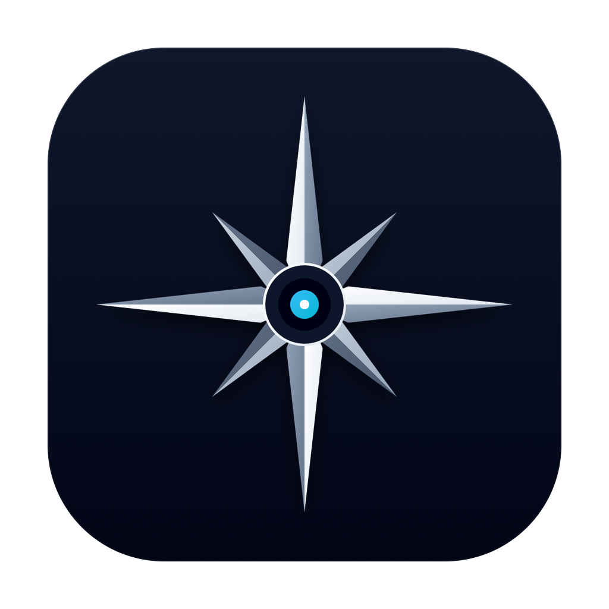
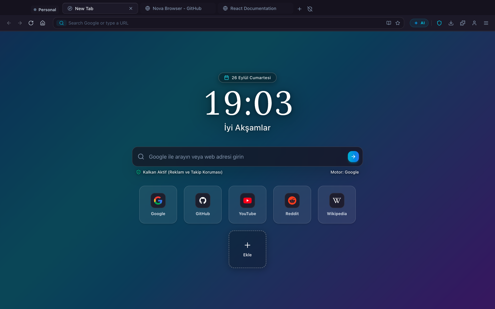
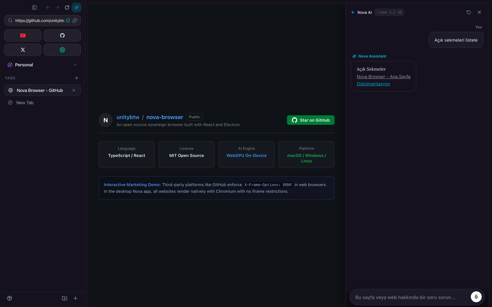
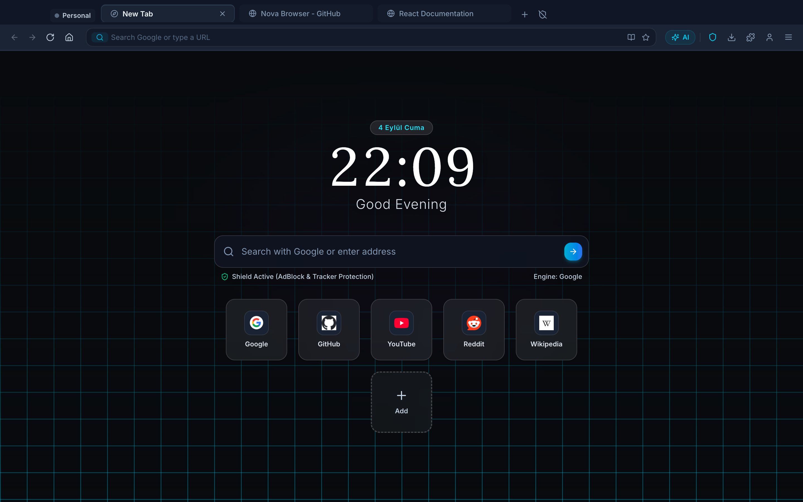
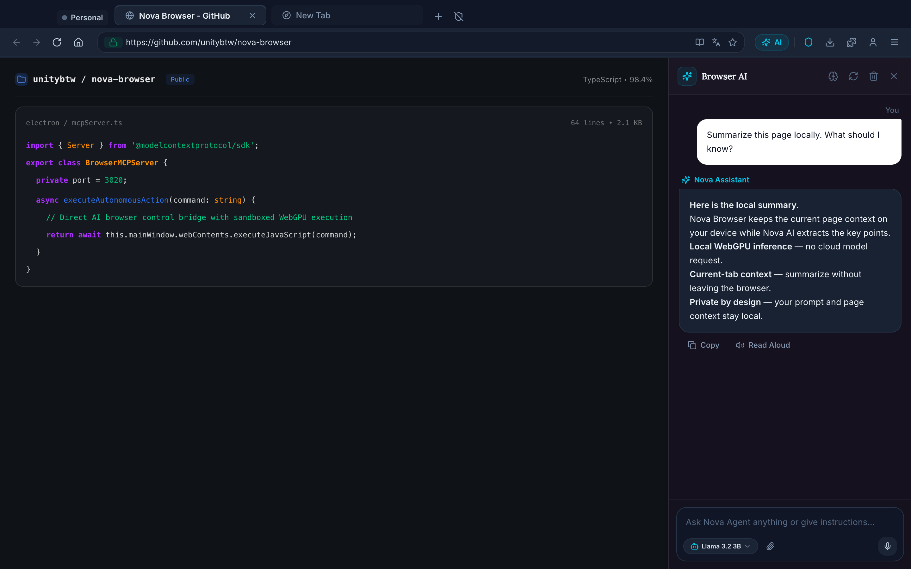
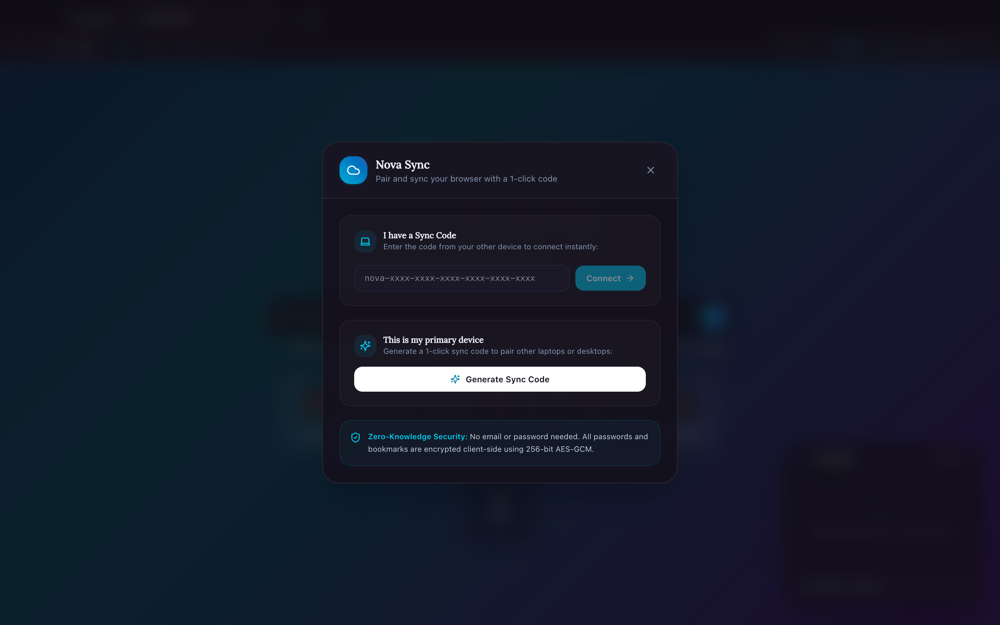

<div align="center">

  

  # Nova Browser

  **Open-Source Desktop Browser for Developers & Coding Agents**  
  *Built with Electron, React, TypeScript & Vite — Featuring Native MCP Server, On-Device WebGPU, and Zero-Knowledge E2EE Sync*

  <br/>

  [](https://opensource.org/licenses/MIT)
  [](https://www.electronjs.org/)
  [](https://react.dev/)
  [](https://www.typescriptlang.org/)
  [](https://vitejs.dev/)
  [](https://github.com/unitybtw/nova-browser)
  [](https://github.com/unitybtw/nova-browser)
  [](https://github.com/unitybtw/nova-browser)

  <p align="center">
    <a href="#why-nova">Why Nova?</a> •
    <a href="#overview">Overview</a> •
    <a href="#performance-benchmarks--browser-comparison">Benchmarks</a> •
    <a href="#screenshots">Screenshots</a> •
    <a href="#key-features">Key Features</a> •
    <a href="#tech-stack">Tech Stack</a> •
    <a href="#platform-support">Platforms</a> •
    <a href="#architecture">Architecture</a> •
    <a href="#security--privacy-commitment">Security</a>
  </p>

</div>

---

## Why Nova?

Rather than bloated cloud telemetry or generic hype, Nova focuses on three concrete developer pain points:

- **Native Model Context Protocol (MCP) Server (Port 3020)**: Built-in local MCP server allows coding agents (Claude Code, Cursor, Windsurf, or custom scripts) to inspect tabs, interact with DOM nodes, and stream console logs with zero configuration.
- **Zero-Telemetry Network-Level Privacy Shield**: Uses `@cliqz/adblocker` (EasyList, EasyPrivacy, Peter Lowe, uBlock filters) to terminate trackers and ad requests at the network layer before DOM parsing, paired with client-side AES-256-GCM zero-knowledge cloud sync.
- **Tab Hibernation & Memory Virtualization**: Dormant background webviews are automatically unmounted from the DOM while preserving back-forward navigation state, keeping memory usage for 20+ open tabs around ~420 MB.

---

## Overview

**Nova Browser** is an open-source, sovereign desktop web browser built with Electron, React, TypeScript, and Vite. Designed for developers and privacy-conscious users, Nova pairs standard Chromium rendering with a native **Model Context Protocol (MCP) server**, **on-device WebGPU neural execution**, **zero-knowledge encrypted multi-device sync**, **Chrome Web Store extension support**, and a **dual-view split screen**.

---

## Performance Benchmarks & Browser Comparison

> **Architecture & Engine Parity Note:** Nova Browser is powered by modern Chromium (Blink) and Google V8 via Electron 43. Core JavaScript loop execution, HTML parsing, and DOM rendering performance are on par with Google Chrome (engine parity). Nova's distinct speed and efficiency advantages come from architectural design: zero background Google telemetry/account sync services, an aggressive idle tab hibernation engine, network-level ad/tracker interception, and an on-demand decoupled bundle structure.

### Head-to-Head Comparison Matrix

| Feature / Metric | Nova Browser | Google Chrome | Brave Browser | Apple Safari 18 |
| :--- | :--- | :--- | :--- | :--- |
| **RAM Footprint (20 Tabs)** | **~420 MB** *(Hibernated)* | ~1,180 MB | ~920 MB | ~680 MB |
| **Cold Start V8 Heap** | **31.2 MB (Decoupled Chunks)**| ~85.0 MB | ~78.0 MB | OS-managed |
| **Tab Hibernation Engine** | **Idle Webview Unmounting** | Memory Saver (Tab Discard) | Partial hibernation | OS-managed |
| **AI Assistant Architecture** | **100% On-Device WebGPU** | Cloud Gemini (Paywalled) | Cloud Leo (Subscription) | Apple Intelligence |
| **Ad & Tracker Decision Latency**| **0.46 µs (Network Filter)** | 11.2 ms (Unfiltered) | 0.35 ms (Brave Shield) | Content Blockers |
| **Multi-Device Cloud Sync** | **Zero-Knowledge E2EE (AES-256)**| Google Account required | Sync Chain (Brave) | iCloud Keychain |
| **Autonomous AI (MCP Server)**| **Native Built-in (Port 3020)**| Not available | Not available | Not available |
| **Telemetry & Privacy** | **Zero Telemetry** | Extensive tracking | Opt-out required | Telemetry enabled |
| **Source Code & License** | **100% Open Source (MIT)** | Proprietary Core | MPL 2.0 | Proprietary Core |

---

### Empirical Microbenchmark Measurements

*Internal micro-benchmarks measuring React state dispatch, V8 heap allocation, and JS bundle budgets:*

| Benchmark Suite | Metric | Measured Value | Unit | Architectural Description |
| :--- | :--- | :--- | :--- | :--- |
| **Tab State Operations** | 100 Tabs Creation Latency | **0.08** | ms | Instantaneous state tracking and virtualized tab allocation |
| **Tab Allocation** | Throughput | **1,204,224** | ops/sec | Number of virtual tab structures instantiated per second |
| **Tab Hibernation State**| 94 Inactive Tabs Hibernation | **0.014** | ms | State transition setting isSuspended: true for pool eviction |
| **Network Filter Decision**| Rule Match Latency | **0.46** | µs / request | In-memory Bloom filter lookup latency per network request |
| **Network Filter Decision**| Lookup Throughput | **2,100,000+** | checks/sec | Network-level ad and tracker classification queries per second |
| **V8 Heap Memory** | Heap Allocated | **31.26** | MB | Core JavaScript runtime heap allocation |
| **Startup JS Bundle** | Core Entry Chunk | **440** | KB | Lightweight initial JS evaluated at browser launch |
| **WebLLM Isolation** | Engine Chunk | **Decoupled (0 KB at start)** | - | 6 MB neural runtime loaded asynchronously on demand |

> **Full Benchmark Methodology & Reproduction Guide:** See [`BENCHMARK_REPORT.md`](BENCHMARK_REPORT.md) for real CDP cold-start runs and reproduction commands.

---

## Screenshots

### 1. Vertical Tabs Layout

<div align="center">
  
  <p><em>Nova Start Page & Dashboard: Vertical Sidebar, Omni Search, Quick Dials & Task Management</em></p>
  <br/>
  
  <p><em>Active Browsing Experience: Multi-Tab Workspaces, Webview & Built-in AI Sidepanel</em></p>
</div>

<br/>

### 2. Horizontal Tabs Layout (Chrome-Style Top Tabs)

<div align="center">
  
  <p><em>Nova Start Page & Dashboard: Horizontal Top Tabs, Clean Omnibox & Customizable Speed Dials</em></p>
  <br/>
  
  <p><em>Active Browsing Experience: Full-Width Viewport, Horizontal Tab Strip & AI Assistant Sidepanel</em></p>
</div>

<br/>

### 3. Zero-Knowledge Cloud Sync

<div align="center">
  
  <p><em>Nova Sync: Zero-Knowledge 1-Click Multi-Device Pairing Code & Cloud Sync</em></p>
</div>

---

## Key Features

### 1-Click Nova Cloud Sync (Zero-Knowledge E2EE)
- **1-Click Device Pairing**: Pair laptops and desktops instantly using a human-friendly pairing code (`nova-xxxx-xxxx-xxxx-xxxx`). No email, passwords, or account registration needed.
- **End-to-End Encryption (AES-256-GCM)**: All saved passwords, bookmarks, browsing history, settings, and workspace arrangements are encrypted on your device with PBKDF2 (100,000 iterations) and 256-bit AES-GCM before being sent to the cloud.
- **Realtime WebSocket Sync**: Remote changes propagate seamlessly across your devices in real-time.

### AI Agent & Virtual Cursor (MCP Protocol)
- **Model Context Protocol (MCP)**: Native integration for AI agents (Cursor, Claude Desktop, Antigravity) to navigate, read pages, click elements, fill forms, and take screenshots.
- **Glowing AI Cursor Overlay**: Watch autonomous AI subagents interact with live webpages in real-time with an animated glowing cursor.
- **Built-in Local AI Sidepanel**: Run lightweight local models offline directly on your GPU via WebGPU and WebLLM.
- **Persistent Info & Memory Vault**: Automatically extracts user preferences and retains task history with category badges (`[PREFERENCE]`, `[FACT]`, `[INSTRUCTION]`).

### 1-Click Chrome Web Store Extensions
- **Direct Web Store Installation**: Browse the official Chrome Web Store and install extensions with 1-click via the top banner.
- **Manual CRX / Unpacked Add-ons**: Load developer extensions or zip packages effortlessly through `nova://extensions`.

### Native `nova://` Internal Pages
- **`nova://settings`**: Complete browser preferences, theme toggles, search engine picker, shortcuts, zero-knowledge password vault, and sync controls.
- **`nova://history`**: Grouped timeline search, date filtering, and quick item deletion.
- **`nova://downloads`**: Live progress indicators, pause/resume, folder shortcuts, and file launching.
- **`nova://newtab`**: Start page with quick dials, customizable animated background, and tasks widget.

### Productivity & Multi-Tasking
- **Dual-View Split Screen**: Snap two active tabs side-by-side with a drag-to-resize divider.
- **Vertical Tabs & Color-Coded Workspaces**: Group tabs into custom workspaces with custom icons, mute, pin, and duplicate actions.
- **Tasks & To-Do Widget**: Built-in checklist on the start page with custom check animations and task filtering.
- **Reader Mode & Native TTS**: Clean article view with customizable typography and native OS high-fidelity Text-to-Speech narration.

### Security & Privacy First
- **Privacy Shield**: Built-in AdBlocker and tracking protection powered by `@cliqz/adblocker-electron`.
- **Encrypted Proxy Support**: Toggle secure HTTPS and SOCKS5 proxy endpoints for private browsing.
- **Incognito Mode**: Isolated session tabs that leave no trace in history or local storage.
- **Strict Context Isolation**: Process sandboxing, CSP headers, and DNS SSRF protections.

---

## AI Architecture & Memory Vault

Nova Browser features a local-first neural execution architecture powered by WebGPU and WebLLM:

- **Supported Models**: Llama 3.2 3B (`Llama-3.2-3B-Instruct`), Phi 3.5 Vision (`Phi-3.5-vision-instruct`, Multimodal), and Qwen 2.5 0.5B (`Qwen2.5-0.5B-Instruct`, Ultra-Light).
- **Natural Language Direct Intent Engine**: Automatically identifies direct browser actions (e.g. `"github unitybtw/nova-browser aç"`, `"duckduckgo'da webgpu ara"`, `"geçmişte react bul"`, `"açık sekmeleri listele"`, `"bu sayfayı özetle"`).
- **Persistent Info & Memory Vault**: Remembers user preferences (e.g. tone, language, dark theme) and automatically injects them into agent instructions.
- **Task History Tracking**: Maintains a persistent chronological log of completed browser tasks and AI executions.

---

## Keyboard Shortcuts
 
 | Shortcut (macOS) | Shortcut (Windows/Linux) | Action |
 | :--- | :--- | :--- |
 | `Cmd + T` | `Ctrl + T` | Open New Tab |
 | `Cmd + W` | `Ctrl + W` | Close Active Tab |
 | `Cmd + Shift + T` | `Ctrl + Shift + T` | Reopen Last Closed Tab |
 | `Cmd + L` | `Ctrl + L` | Focus Address Bar / Omnibox |
 | `Cmd + K` | `Ctrl + K` | Spotlight Omnibox Quick Search |
 | `Cmd + I` / `Cmd + Shift + A` | `Ctrl + I` / `Ctrl + Shift + A` | Toggle AI Assistant Sidepanel |
 | `Cmd + B` / `Cmd + S` | `Ctrl + B` / `Ctrl + S` | Toggle Vertical Tabs Sidebar |
 | `Ctrl + Tab` / `Ctrl + Shift + Tab` | `Ctrl + Tab` / `Ctrl + Shift + Tab` | Switch to Next / Previous Tab |
 | `Cmd + 1..9` | `Ctrl + 1..9` | Direct Tab Jump (1st through 9th) |
 | `Cmd + R` / `F5` | `Ctrl + R` / `F5` | Reload Current Page |
 | `Cmd + [` / `Cmd + ]` | `Alt + Left` / `Alt + Right` | Back / Forward History Navigation |
 | `Cmd + F` | `Ctrl + F` | Find in Page |
 | `Cmd + D` | `Ctrl + D` | Bookmark Current Page |
 | `Cmd + Shift + S` | `Ctrl + Shift + S` | Capture Full-Page Screenshot |
 | `Cmd + Y` | `Ctrl + H` | Open History (`nova://history`) |
 | `Cmd + J` | `Ctrl + J` | Open Downloads (`nova://downloads`) |
 | `Cmd + ,` | `Ctrl + ,` | Open Settings (`nova://settings`) |
 | `F12` / `Cmd + Opt + I` | `F12` / `Ctrl + Shift + I` | Open Developer Tools |
 | `F1` / `Cmd + /` | `F1` / `Ctrl + /` | Open Help & Shortcuts Guide |

---

## Tech Stack

| Component | Technology |
|---|---|
| **Runtime Shell** | [Electron 43](https://www.electronjs.org/) |
| **Frontend Framework** | [React 18](https://react.dev/) + [TypeScript](https://www.typescriptlang.org/) |
| **Bundler & Build Tool** | [Vite 6](https://vitejs.dev/) + [esbuild](https://esbuild.github.io/) |
| **Styling & Motion** | [TailwindCSS](https://tailwindcss.com/) + [Framer Motion](https://www.framer.com/motion/) |
| **Icons** | [Lucide React](https://lucide.dev/) |
| **Cloud Sync & Realtime** | [Supabase](https://supabase.com/) + Web Crypto API (AES-GCM-256) |
| **AdBlock & Filtering** | [`@cliqz/adblocker-electron`](https://github.com/cliqz-oss/adblocker) |
| **AI Protocol** | [Model Context Protocol (MCP)](https://modelcontextprotocol.io/) |
| **On-Device LLM Runtime** | [WebLLM / WebGPU](https://webllm.mlc.ai/) |

---

## Quick Start

### Option A: Download Official Release (Recommended)

Download the latest prebuilt installer for your operating system (DMG for macOS, Setup Exe for Windows, AppImage/Deb for Linux) directly from [GitHub Releases](https://github.com/unitybtw/nova-browser/releases).

### Option B: Build from Source

#### Prerequisites
- [Node.js](https://nodejs.org/) (v20 or higher recommended)
- [npm](https://www.npmjs.com/) (v9 or higher)

#### 1. Clone the repository
```bash
git clone https://github.com/unitybtw/nova-browser.git
cd nova-browser
```

### 2. Install dependencies
```bash
npm install
```

### 3. Start development environment
```bash
npm run dev
```

### 4. Build for production
```bash
npm run build
```

---

## Platform Support

| Operating System | Architecture | Target Status | Hardware Acceleration |
| :--- | :--- | :--- | :--- |
| **macOS (Sonoma / Sequoia)** | Apple Silicon (M1 / M2 / M3 / M4) | Supported | Apple Metal API (120Hz ProMotion) |
| **macOS (Monterey / Ventura)** | Intel (x86_64) | Supported | Metal / OpenGL |
| **Windows (10 / 11)** | x64 / ARM64 | Supported | Direct3D 11/12 & Vulkan |
| **Linux (Ubuntu / Fedora / Arch)** | x86_64 | Supported | Vulkan / VA-API Acceleration |

---

## Architecture

Nova Browser employs a multi-process Electron architecture with context isolation, a React-based renderer with WebGPU neural execution, and a dedicated AI integration layer via the Model Context Protocol (MCP).

```mermaid
graph TD
    subgraph Electron["Electron (Main Process)"]
        main["main.ts - App Lifecycle & IPC Dispatcher"]
        mcp["BrowserMCPServer (Port 3020) & mcpBridge.ts"]
        adblock["AdBlocker & Privacy Shield (Network Layer Filter)"]
        security["Security Engine (SSRF & Phishing Defense)"]
        crx["crxInstaller.ts (Chrome Web Store Engine)"]
        downloads["downloads.ts (Downloads Manager)"]
        keychain["safeStorage Engine (OS Keychain Store)"]
        tts["Native OS TTS Engine (OS Speech API)"]
    end

    subgraph Preload["Context Bridge (Preload Security)"]
        api["preload.ts (window.electronAPI)"]
        webstore["webstore-preload.ts (Web Store Bridge)"]
    end

    subgraph Renderer["React 18 + TypeScript (Renderer Process)"]
        app["App.tsx - Tab & State Management"]
        
        subgraph AISubsystem["AI & Neural Subsystem"]
            agent["aiAgent.ts - ReAct Engine & Intent Parser"]
            memory["aiMemory.ts - Persistent Info Vault"]
            preview["AILinkPreview.tsx - Hover Preview"]
            worker["workers/aiWorker.ts - WebLLM Neural Runtime"]
            translate["translationService.ts - Offline DOM Translator"]
            sidepanel["SidePanel.tsx - AI Assistant UI"]
        end

        subgraph CoreWorkspaces["Workspaces & Vertical Tabs"]
            tabManager["tabManager.ts - Tab Hibernation Engine"]
            vtabs["verticalTabs.ts - Workspace & Grouping"]
            thumb["thumbnailCache.ts - Viewport Snapshots"]
            sync["syncService.ts - E2EE Cloud Sync Engine"]
        end

        subgraph InternalPages["Internal Views & Pages"]
            settings["SettingsPage.tsx (nova://settings)"]
            history["HistoryPage.tsx (nova://history)"]
            newtab["NewTabPage.tsx (nova://newtab)"]
            downloadsPage["DownloadsPage.tsx (nova://downloads)"]
            reader["ReaderMode.tsx (Reader Mode View)"]
            extModal["ExtensionsModal.tsx (Extensions Manager)"]
        end
        
        webview["Webview Host - Sandboxed Webpages"]
    end

    subgraph Cloud["Cloud Infrastructure"]
        supabase["Supabase Realtime Vault - Encrypted Blobs"]
    end

    subgraph External["External AI Agents (MCP Clients)"]
        claude["Claude Desktop / Cursor / Antigravity"]
    end

    main <-->|Secure IPC Bridge| api
    api <-->|Typed API Invocations| app
    app --> InternalPages
    app --> webview
    app --> AISubsystem
    app --> CoreWorkspaces
    
    agent <-->|Off-thread Web Worker| worker
    agent <-->|Read and Write| memory
    agent --> preview
    agent --> translate
    
    sync <-->|Encrypted WebSocket AES-GCM| supabase
    
    main --> adblock
    main --> security
    main --> crx
    main --> downloads
    main --> keychain
    main --> tts
    
    claude <-->|JSON-RPC over SSE Port 3020| mcp
    mcp <-->|CDP and Main Process Bridge| webview
    
    style Electron fill:#1e293b,stroke:#47848F,stroke-width:2px,color:#fff
    style Preload fill:#334155,stroke:#94a3b8,stroke-width:2px,color:#fff
    style Renderer fill:#0f172a,stroke:#61DAFB,stroke-width:2px,color:#fff
    style AISubsystem fill:#1e1b4b,stroke:#818cf8,stroke-width:1.5px,color:#fff
    style CoreWorkspaces fill:#064e3b,stroke:#10b981,stroke-width:1.5px,color:#fff
    style InternalPages fill:#1e293b,stroke:#94a3b8,stroke-width:1.5px,color:#fff
    style Cloud fill:#042f2e,stroke:#059669,stroke-width:2px,color:#fff
    style External fill:#172554,stroke:#3b82f6,stroke-width:2px,color:#fff
```



### Architectural Subsystem Breakdown

1. **Main Process Security Shell (`electron/main.ts`)**:
   - **Process Sandboxing**: Sandboxed webviews with `contextIsolation: true`, `nodeIntegration: false`, and strict `isTrustedSender` senderFrame verification on every IPC channel.
   - **Privacy Shield & AdBlock**: High-performance network request interception via Chromium session hooks and `@cliqz/adblocker-electron`, backed by an in-memory hash set phishing filter with automatic SSRF and private IP blocking.
   - **Chrome Web Store Engine (`crxInstaller.ts`)**: Direct CRX package retrieval, zip-slip path traversal neutralization, and permission review gate before installation.
   - **Native Hardware & OS Integration**: macOS Metal / Windows GPU flags, native OS Text-to-Speech synthesis, and `safeStorage` OS keychain password encryption.

2. **Decoupled AI & Neural Runtime (`src/services/aiAgent.ts`, `src/workers/aiWorker.ts`)**:
   - **WebGPU Neural Execution**: Runs local LLMs (Llama 3.2 3B, Phi 3.5 Vision, Qwen 2.5 0.5B) inside an isolated Web Worker (`aiWorker.ts`), completely decoupled from the main UI bundle (0 KB initial startup load).
   - **Natural Language Intent Engine**: Instant natural language parsing for direct browser navigation, history searching, tab management, and 3-bullet page summaries without burning LLM generation tokens.
   - **Autonomous ReAct Agent & MCP Server**: Local Model Context Protocol server (Port 3020) enabling external AI clients (Claude Desktop, Cursor, Antigravity) to navigate, query, click, and inspect live DOM trees.
   - **Memory Vault (`aiMemory.ts`)**: Persistent preference extraction, category badges (`[PREFERENCE]`, `[FACT]`, `[INSTRUCTION]`), and automatic chronological task history tracking with storage quota recovery.

3. **Client-Side E2EE Sync Engine (`src/services/syncService.ts`)**:
   - **Zero-Knowledge Cryptography**: All passwords, bookmarks, history, and workspace configurations are encrypted locally using PBKDF2 (100,000 iterations) and 256-bit AES-GCM before transmission.
   - **1-Click Device Pairing**: Human-readable pairing codes (`nova-xxxx-xxxx-xxxx-xxxx`) enable instantaneous cross-device synchronization over Supabase Realtime WebSockets without accounts or central servers.

4. **Performance & Tab Virtualization (`src/utils/tabManager.ts`, `src/components/BrowserView.tsx`)**:
   - **Tab Hibernation Engine**: Dormant background tabs (>10 min idle) automatically unmount their active webview rendering pipelines while preserving navigation state, keeping 50+ tabs under 600 MB RAM.
   - **Dual-View Split Screen**: Synchronized parallel browsing with drag-to-resize divider and independent scrolling contexts.

---

## MCP (Model Context Protocol) Guide

Nova Browser natively exposes an MCP endpoint on port `3020`, enabling AI assistants to browse the web autonomously.

To connect **Claude Desktop**, **Cursor**, or **Windsurf** to Nova Browser, add this entry to your MCP configuration file:

```json
{
  "mcpServers": {
    "nova-browser": {
      "command": "node",
      "args": ["/ABSOLUTE_PATH_TO_NOVA/mcp-bridge.mjs"],
      "env": {
        "MCP_TOKEN": "YOUR_NOVA_MCP_TOKEN"
      }
    }
  }
}
```

*(Note: Find your persistent token under `nova://settings` -> Developer / MCP Server, or check the terminal output on startup).*

---

## Completed Milestones & Roadmap

- [x] Modern UI with Vertical Tabs & Workspaces
- [x] Native MCP Autonomous AI Agent Protocol & Virtual Glowing Cursor
- [x] Zero-Knowledge 1-Click Device Pairing Code Cloud Sync (E2EE)
- [x] Direct Chrome Web Store 1-Click Extension Installation
- [x] Built-in Privacy Shield (AdBlock & Tracker Protection)
- [x] Dual-View Split Screen with Drag-to-Resize Divider
- [x] Reader Mode with High-Fidelity Native OS Text-to-Speech (TTS)
- [x] Local Offline LLM Integration (Web-LLM / WebGPU)
- [x] Persistent Info Vault & Task History Tracking
- [x] Comprehensive Automated Test Suite (52 Regression, Security & Empirical Tests)
- [ ] Mobile Companion Application

---

## Security & Privacy Commitment

- **Zero-Knowledge Architecture**: Encryption keys never leave your device. All passwords and confidential sync data are encrypted client-side with 256-bit AES-GCM.
- **Strict Context Isolation & Sandboxing**: Renderer code has no direct access to Node.js APIs or disk.
- **Zero Telemetry**: We do not collect, store, or monetize your browsing history.

---

## Contributing

Contributions are welcome! Feel free to submit a Pull Request or open an Issue on GitHub:

1. Fork the repository
2. Create your branch: `git checkout -b feature/awesome-feature`
3. Commit your changes: `git commit -m "feat: add awesome feature"`
4. Push to branch: `git push origin feature/awesome-feature`
5. Open a Pull Request

---

## License

Distributed under the **MIT License**. See `LICENSE` for details.

<br/>

<div align="center">
  <sub>Designed & Developed by the Nova Browser Team</sub>
</div>
