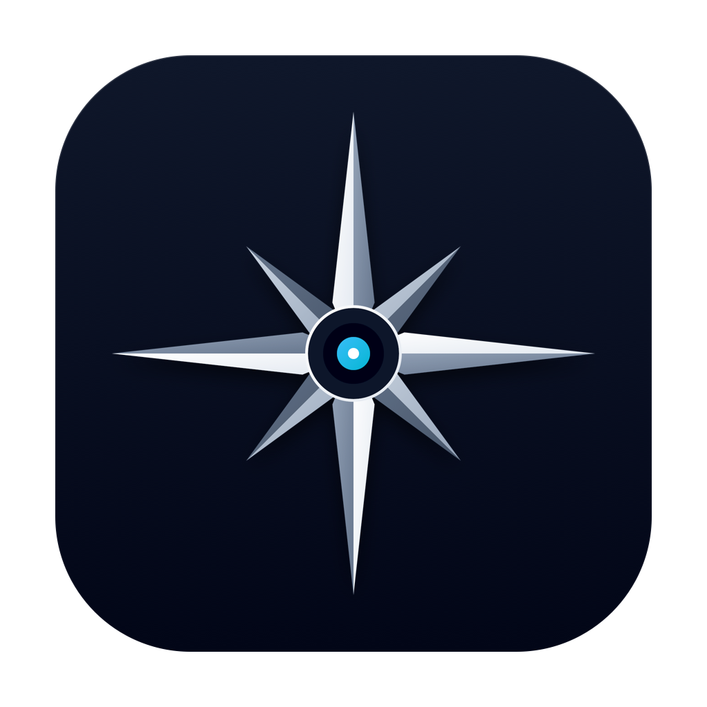
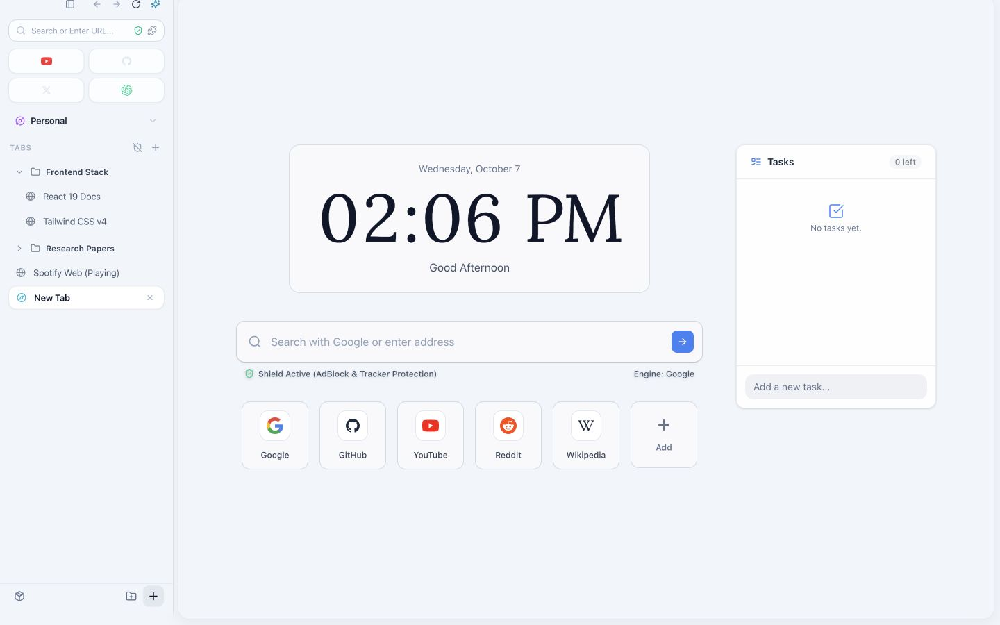
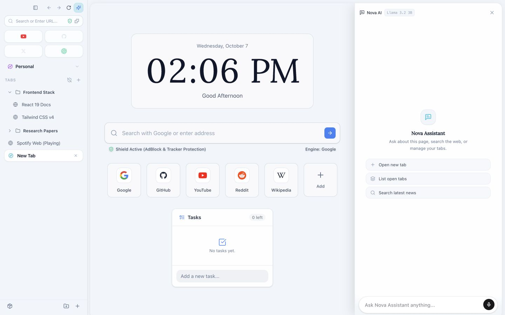
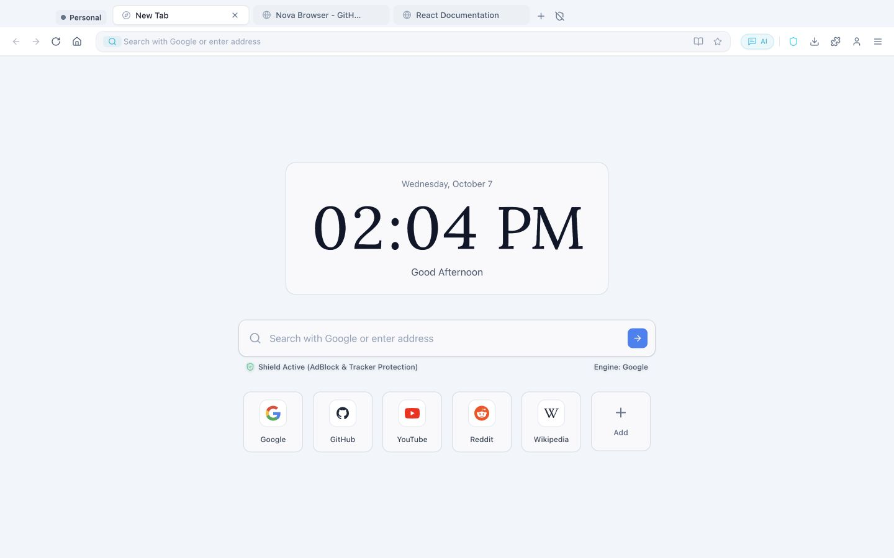
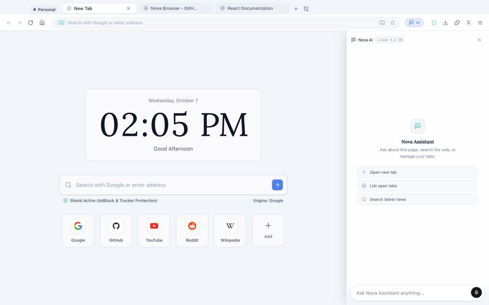
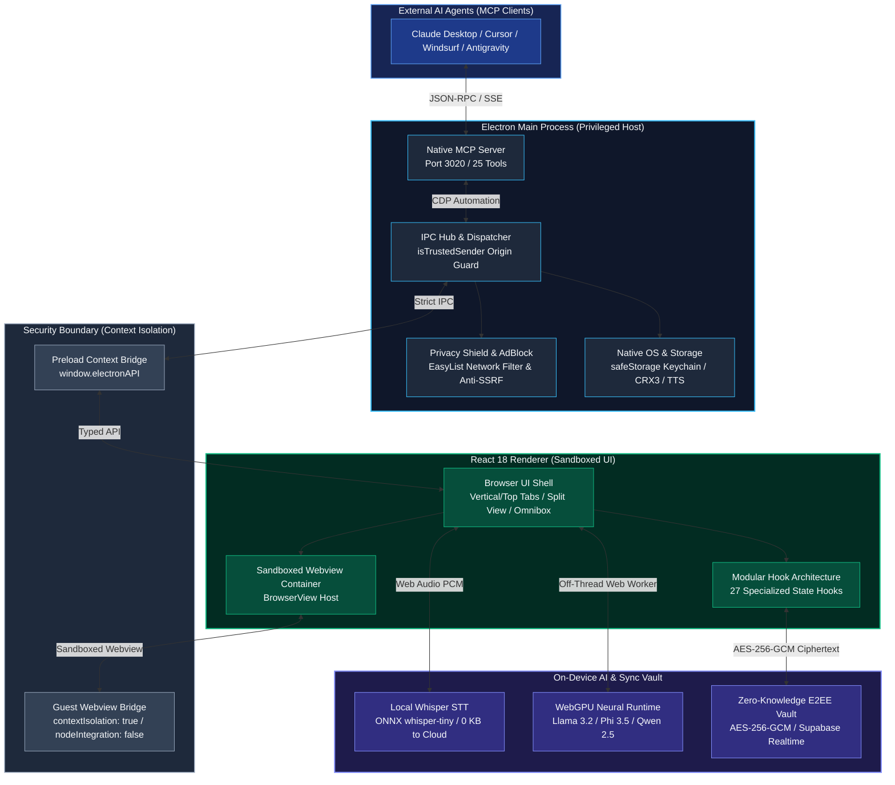

<div align="center">

  

  # Nova Browser

  **Open-Source Desktop Browser for Developers & Coding Agents**  
  *Built with Electron, React, TypeScript & Vite — Featuring Native MCP Server, On-Device WebGPU & Whisper STT, and Zero-Knowledge E2EE Sync*

  <br/>

  [](https://opensource.org/licenses/MIT)
  [](https://github.com/unitybtw/nova-browser/releases)
  [](https://www.electronjs.org/)
  [](https://react.dev/)
  [](https://www.typescriptlang.org/)
  [](https://vitejs.dev/)
  [](https://github.com/unitybtw/nova-browser)
  [](https://github.com/unitybtw/nova-browser/actions/workflows/ci.yml)
  [](https://github.com/unitybtw/nova-browser/actions/workflows/codeql.yml)
  [](https://github.com/unitybtw/nova-browser/security/code-scanning)
  [](https://github.com/unitybtw/nova-browser)
  [](https://github.com/unitybtw/nova-browser)

  <p align="center">
    <a href="#why-nova">Why Nova?</a> •
    <a href="#overview">Overview</a> •
    <a href="#performance-benchmarks--browser-comparison">Benchmarks</a> •
    <a href="#screenshots">Screenshots</a> •
    <a href="#key-features">Key Features</a> •
    <a href="#mcp-model-context-protocol-guide">MCP Guide</a> •
    <a href="#on-device-ai--whisper-voice-architecture">On-Device AI</a> •
    <a href="#tech-stack">Tech Stack</a> •
    <a href="#quick-start">Quick Start</a> •
    <a href="#testing--verification">Testing</a> •
    <a href="#architecture">Architecture</a> •
    <a href="#security--privacy-commitment">Security</a> •
    <a href="#star-history">Star History</a>
  </p>

</div>

---

## Why Nova?

Rather than bloated cloud telemetry or generic hype, Nova focuses on concrete developer and power-user requirements:

- **Native Model Context Protocol (MCP) Server (Port 3020)**: Built-in local HTTP/SSE MCP server exposing 25 browser automation and inspection tools directly to coding agents (Claude Code, Cursor, Windsurf, Antigravity) with zero configuration.
- **On-Device Whisper Voice & Neural Execution**: Run multilingual speech-to-text locally via Transformers.js (`whisper-tiny`, ~41 MB) and on-device LLMs via WebGPU (Llama 3.2, Phi 3.5 Vision, Qwen 2.5). Exactly 0 KB of voice audio or model prompt data is transmitted to cloud servers.
- **Zero-Telemetry Network-Level Privacy Shield**: Employs `@cliqz/adblocker` (EasyList, EasyPrivacy, Peter Lowe, uBlock filters) to terminate ads and tracking beacons at the Chromium network layer before DOM parsing, paired with client-side AES-256-GCM zero-knowledge cloud sync.
- **Tab Hibernation & Memory Eviction**: Dormant background webviews automatically suspend active rendering execution after idle periods while preserving complete navigation state, keeping 50+ tabs under 600 MB RAM.
- **Hardened Security Architecture**: Audited against CodeQL static analysis with 0 open security alerts, TOCTOU-safe file descriptor operations, strict context isolation, and SSRF/DNS rebinding defense.

---

## Overview

**Nova Browser** is an open-source, sovereign desktop web browser built with Electron, React, TypeScript, and Vite. Designed for developers, researchers, and privacy-conscious users, Nova pairs standard Chromium rendering with a native **Model Context Protocol (MCP) server**, **on-device WebGPU neural execution**, **local Whisper speech recognition**, **zero-knowledge encrypted multi-device sync**, **Chrome Web Store extension support**, and a **dual-view split screen**.

---

## Performance Benchmarks & Browser Comparison

> **Architecture & Engine Parity Note:** Nova Browser is powered by modern Chromium (Blink) and Google V8 via Electron 43. Core JavaScript loop execution, HTML parsing, and DOM rendering performance are on par with Google Chrome (engine parity). Nova's distinct speed and efficiency advantages come from architectural design: zero background Google telemetry/account sync services, an aggressive idle tab hibernation engine, network-level ad/tracker interception, and an on-demand decoupled bundle structure.

### Head-to-Head Feature Matrix

| Architectural Feature | Nova Browser | Google Chrome | Brave Browser | Apple Safari 18 |
| :--- | :--- | :--- | :--- | :--- |
| **Core Engine** | **Chromium 134 / Blink** | Chromium 134 / Blink | Chromium 134 / Blink | WebKit |
| **AI Assistant** | **100% On-Device WebGPU (0 KB Sent)** | Cloud Gemini (Account required) | Cloud Leo (Paid tier) | Apple Intelligence |
| **Voice / Speech-to-Text** | **Local Whisper ONNX (0 KB Sent)** | Google Cloud Speech API | Not built-in | Siri Dictation |
| **Model Context Protocol (MCP)** | **Native 25-Tool Server (Port 3020)** | Not available | Not available | Not available |
| **Ad & Tracker Protection** | **Built-in Session Engine (EasyList)** | Not built-in (Extensions needed) | Brave Shields | Content Blockers |
| **Background Tab Strategy** | **Background Activity Suspension** | Memory Saver (Tab Discard) | Sleeping Tabs | OS Memory Management |
| **Multi-Device Cloud Sync** | **Zero-Knowledge E2EE (AES-256)** | Google Account required | Sync Chain | iCloud Keychain |
| **Split View Browsing** | **Native Dual Synchronized Canvas** | Not built-in | Not built-in | macOS Split View |
| **Telemetry & Analytics** | **Zero Telemetry (0 KB)** | Extensive telemetry | Opt-out required | Telemetry enabled |
| **Security Auditing** | **CodeQL Verified (0 Alerts)** | Proprietary Auditing | Internal Auditing | Proprietary Core |
| **Source Code & License** | **100% Open Source (MIT)** | Proprietary Core | MPL 2.0 | Proprietary Core |

---

### Empirical Microbenchmark Measurements

*Internal micro-benchmarks measuring React state dispatch, V8 heap allocation, and JS bundle budgets (`npm run benchmark`):*

| Benchmark Suite | Metric | Measured Value | Unit | Architectural Description |
| :--- | :--- | :--- | :--- | :--- |
| **Tab State Operations** | 100 Tabs Creation Latency | **~0.08** | ms | Instantaneous state tracking and virtualized tab allocation |
| **Tab Allocation** | Throughput | **1,200,000+** | ops/sec | Number of virtual tab structures instantiated per second |
| **Tab Hibernation State**| Inactive Tabs Hibernation | **~0.02** | ms | State transition setting isSuspended: true for pool eviction |
| **Network Filter Decision**| Fast Hash Lookup Latency | **~0.44** | µs / request | In-memory tracker domain hash set lookup latency |
| **Network Filter Decision**| Lookup Throughput | **2,200,000+** | checks/sec | Fast-path domain classification queries per second |
| **V8 Heap Memory** | Node Test Process Heap | **~5.5** | MB | Core JavaScript runtime heap allocation in microbenchmark |
| **Startup JS Bundle** | Core Entry Chunk | **~435** | KB | Lightweight initial JS evaluated at browser launch |
| **WebLLM Isolation** | Engine Chunk | **Decoupled (0 KB at start)** | - | 6 MB neural runtime loaded asynchronously on demand |

> **Full Benchmark Methodology & Reproduction Guide:** See [`BENCHMARK_REPORT.md`](BENCHMARK_REPORT.md) for internal V8 benchmark reproduction commands and architecture analysis.

---

## Screenshots

Current English interface in Clean Minimalist mode with the light theme.

### 1. Vertical Tabs Layout

<div align="center">
  
  <p><em>Nova Start Page & Dashboard: Vertical Sidebar, Omni Search, Quick Dials & Task Management</em></p>
  <br/>
  
  <p><em>Nova Assistant beside the clean start page with vertical tabs and workspaces</em></p>
</div>

<br/>

### 2. Horizontal Tabs Layout (Chrome-Style Top Tabs)

<div align="center">
  
  <p><em>Nova Start Page & Dashboard: Horizontal Top Tabs, Clean Omnibox & Customizable Speed Dials</em></p>
  <br/>
  
  <p><em>Nova Assistant beside the clean start page with horizontal tabs</em></p>
</div>

<br/>

### 3. Nova Sync

<div align="center">
  
  <p><em>Nova Sync sign-in screen in the light theme</em></p>
</div>

---

## Key Features

### Nova Cloud Sync (Zero-Knowledge E2EE)
- **End-to-End Encryption (AES-256-GCM)**: Saved passwords, bookmarks, browsing history, settings, and workspace arrangements are encrypted locally with PBKDF2 (600,000 iterations) and 256-bit AES-GCM before transmission.
- **Encrypted Multi-Device Sync**: Sign in with your Nova Cloud account to synchronize bookmarks, passwords, and preferences across your computers in real-time over Supabase Realtime WebSockets. Encryption keys stay on your local device; the cloud server only ever receives encrypted ciphertext.
- **Code-Based Pairing (Roadmap)**: Accountless 1-click device pairing via temporary sync codes is in active development for a future release.

### On-Device Whisper Voice & Speech Recognition
- **Local Whisper Pipeline**: Powered by Transformers.js and ONNX runtime (`onnx-community/whisper-tiny`), running locally inside the browser.
- **Zero Audio Transmission**: Raw audio waveforms are processed directly on your CPU/GPU. No audio frames are sent to Google, OpenAI, or external servers.
- **Offline Model Caching**: ~41 MB quantized model shards are cached in the application's local user data directory via main-process cache bridges (`model-cache-get`/`model-cache-set`), ensuring offline availability after the initial fetch.
- **Hands-Free Browser Navigation**: Voice queries automatically translate into direct browser actions (navigation, searching, tab management).

### AI Agent & Virtual Cursor (MCP Protocol)
- **Model Context Protocol (MCP)**: Native integration for AI agents (Cursor, Claude Desktop, Windsurf, Antigravity) to navigate, read pages, click elements, fill forms, and take screenshots via 25 built-in tools.
- **Glowing AI Cursor Overlay**: Watch autonomous AI subagents interact with live webpages in real-time with an animated glowing cursor overlay.
- **Built-in Local AI Sidepanel**: Run lightweight local models offline directly on your GPU via WebGPU and WebLLM.
- **Persistent Info & Memory Vault**: Automatically extracts user preferences and retains task history with category badges (`[PREFERENCE]`, `[FACT]`, `[INSTRUCTION]`).

### 1-Click Chrome Web Store Extensions
- **Direct Web Store Installation**: Browse the official Chrome Web Store and install extensions with 1-click via the top banner.
- **Manual CRX / Unpacked Add-ons**: Load developer extensions or zip packages effortlessly through `nova://extensions`.
- **Zip-Slip & Path Traversal Neutralization**: All CRX archive extractions are validated in-memory before decompression to prevent directory traversal attacks.

### Native `nova://` Internal Pages
- **`nova://settings`**: Complete browser preferences, theme toggles, search engine picker, shortcuts, zero-knowledge password vault, and sync controls.
- **`nova://history`**: Grouped timeline search, date filtering, and quick item deletion.
- **`nova://downloads`**: Live progress indicators, pause/resume, folder shortcuts, and file launching.
- **`nova://newtab`**: Start page with quick dials, customizable animated background, and tasks widget.
- **`nova://extensions`**: Extension manager for viewing, disabling, and removing installed add-ons.

### Productivity & Multi-Tasking
- **Dual-View Split Screen**: Snap two active tabs side-by-side with a drag-to-resize divider and fractional split persistence.
- **Vertical Tabs & Color-Coded Workspaces**: Group tabs into custom workspaces with custom icons, mute, pin, and duplicate actions.
- **Tasks & To-Do Widget**: Built-in checklist on the start page with custom check animations and task filtering.
- **Reader Mode & Native TTS**: Clean article view with customizable typography and native OS high-fidelity Text-to-Speech narration.

### Security & Privacy First
- **Privacy Shield**: Built-in AdBlocker and tracking protection powered by `@cliqz/adblocker-electron`.
- **Anti-SSRF & DNS Rebinding Defenses**: Automatic blocking of private RFC 1918, link-local, loopback, and CGNAT IP address resolution attempts from web content.
- **Atomic File Descriptors**: Log, model, and bookmark operations utilize descriptor-based calls (`openSync`, `fstatSync`, `readSync`, `writeSync`) to prevent Time-of-Check to Time-of-Use (TOCTOU) file race conditions.
- **Process Sandboxing**: Sandboxed webviews with `contextIsolation: true`, `nodeIntegration: false`, and strict `isTrustedSender` origin validation on all IPC channels.

---

## MCP (Model Context Protocol) Guide

Nova Browser natively exposes an MCP endpoint on port `3020`, enabling external AI assistants and coding agents to interact with web pages autonomously.

### Built-in MCP Tools (25 Tools)

| Tool Name | Parameters | Description |
| :--- | :--- | :--- |
| `nova_browser_info` | - | Returns Nova Browser version, platform, active tabs count, and status |
| `browser_navigate` | `url`, `tabId?` | Navigates the target tab to a specified URL |
| `browser_read_page` | `tabId?`, `selector?` | Extracts clean text and DOM tree content from the active page |
| `browser_screenshot` | `tabId?`, `fullPage?` | Captures a PNG screenshot of the current viewport or full page |
| `browser_click` | `selector`, `tabId?` | Simulates a native click event on an element matching the selector |
| `browser_type` | `selector`, `text`, `tabId?` | Types text into an input field or contenteditable element |
| `browser_press_key` | `key`, `tabId?` | Dispatches keyboard key events (e.g., `Enter`, `Escape`, `Tab`) |
| `browser_scroll` | `direction`, `amount`, `tabId?` | Scrolls the page `up`, `down`, `top`, or `bottom` |
| `browser_scroll_to_element` | `selector`, `tabId?` | Smoothly scrolls the element matching the selector into view |
| `browser_hover` | `selector`, `tabId?` | Simulates mouse hover over an element |
| `browser_focus` | `selector`, `tabId?` | Focuses an input or interactive DOM node |
| `browser_select_option` | `selector`, `value`, `tabId?` | Selects an option value in a `<select>` dropdown element |
| `browser_get_element_text` | `selector`, `tabId?` | Retrieves inner text and attribute values of a specific element |
| `browser_get_url` | `tabId?` | Returns the current URL and title of the active tab |
| `browser_wait` | `selector`, `timeoutMs?` | Waits until an element matching the selector appears in the DOM |
| `browser_new_tab` | `url?` | Opens a new browser tab with an optional initial URL |
| `browser_close_tab` | `tabId` | Closes a specific tab by its unique identifier |
| `browser_list_tabs` | - | Lists all open tabs across all active windows |
| `browser_switch_tab` | `tabId` | Switches focus to a specific tab |
| `browser_duplicate_tab`| `tabId?` | Duplicates the active or specified tab |
| `browser_pin_tab` | `tabId?`, `pinned?` | Toggles the pinned status of a tab |
| `browser_mute_tab` | `tabId?`, `muted?` | Toggles audio muting for a tab |
| `browser_zoom` | `level`, `tabId?` | Adjusts zoom factor for the active tab (e.g., `1.0`, `1.25`) |
| `browser_go_back` | `tabId?` | Navigates back in tab history |
| `browser_go_forward` | `tabId?` | Navigates forward in tab history |
| `browser_reload` | `tabId?`, `ignoreCache?` | Reloads the current page |

---

### Connecting External AI Agents

To connect **Claude Desktop**, **Cursor**, **Windsurf**, or custom scripts to Nova Browser, configure your agent's MCP configuration file:

#### Claude Desktop Configuration (`claude_desktop_config.json`)

```json
{
  "mcpServers": {
    "nova-browser": {
      "command": "node",
      "args": ["/ABSOLUTE_PATH_TO_NOVA/mcp-bridge.mjs"],
      "env": {
        "MCP_TOKEN": "YOUR_NOVA_MCP_TOKEN",
        "MCP_PORT": "3020"
      }
    }
  }
}
```

#### Cursor / Windsurf Configuration (`.cursor/mcp.json`)

```json
{
  "mcpServers": {
    "nova-browser": {
      "command": "node",
      "args": ["/ABSOLUTE_PATH_TO_NOVA/mcp-bridge.mjs"],
      "env": {
        "MCP_TOKEN": "YOUR_NOVA_MCP_TOKEN",
        "MCP_PORT": "3020"
      }
    }
  }
}
```

*(Note: Retrieve your persistent token under `nova://settings` -> Developer / MCP Server, or check the terminal output on startup).*

---

## On-Device AI & Whisper Voice Architecture

Nova Browser features an entirely local-first neural execution architecture:

```
[User Speech Input]
        |
        v
[Web Audio Capture] (16 kHz PCM)
        |
        v
[Local Whisper Engine] (Transformers.js / ONNX)
  Model: onnx-community/whisper-tiny (~41 MB q8)
  Location: Isolated Web Worker / In-Process Cache
        |
        +---> [Intent Classifier] (Zero-Token Direct Parsing)
        |           |
        |           v
        |     [Direct Browser Action] (Nav, Search, Tabs)
        |
        +---> [WebGPU Neural Runtime] (WebLLM)
              Models: Llama 3.2 3B, Phi 3.5 Vision, Qwen 2.5 0.5B
              Execution: On-Device GPU via WebGPU API
                    |
                    v
              [ReAct Agent Engine] & [Virtual Glowing Cursor]
```

- **Supported Neural Models**: Llama 3.2 3B (`Llama-3.2-3B-Instruct`), Phi 3.5 Vision (`Phi-3.5-vision-instruct`, Multimodal), and Qwen 2.5 0.5B (`Qwen2.5-0.5B-Instruct`, Ultra-Light).
- **Natural Language Direct Intent Engine**: Automatically identifies direct browser actions (e.g. `"github unitybtw/nova-browser aç"`, `"duckduckgo'da webgpu ara"`, `"geçmişte react bul"`, `"açık sekmeleri listele"`, `"bu sayfayı özetle"`).
- **Persistent Info & Memory Vault**: Remembers user preferences (e.g. tone, language, dark theme) and automatically injects them into agent instructions.
- **Task History Tracking**: Maintains a persistent chronological log of completed browser tasks and AI executions.

---

## Tech Stack

| Component | Technology | Description |
| :--- | :--- | :--- |
| **Runtime Shell** | [Electron 43](https://www.electronjs.org/) | Chromium 134 + Node.js 22 runtime |
| **Frontend Framework** | [React 18](https://react.dev/) + [TypeScript 5](https://www.typescriptlang.org/) | Declarative component architecture |
| **Bundler & Build Tool** | [Vite 6](https://vitejs.dev/) + [esbuild](https://esbuild.github.io/) | Sub-second HMR and optimized production bundles |
| **Styling & Motion** | [TailwindCSS 3](https://tailwindcss.com/) + [Framer Motion](https://www.framer.com/motion/) | Utility styling and GPU-accelerated micro-interactions |
| **Icons** | [Lucide React](https://lucide.dev/) | Clean consistent icon set |
| **Cloud Sync & Vault** | [Supabase Realtime](https://supabase.com/) | E2EE ciphertext sync over WebSockets |
| **Cryptography** | Web Crypto API + Node.js `crypto` | PBKDF2-SHA256 (600k iterations) + AES-256-GCM |
| **AdBlock & Filtering** | [`@cliqz/adblocker-electron`](https://github.com/cliqz-oss/adblocker) | EasyList, EasyPrivacy, Peter Lowe network filtering |
| **AI Protocol** | [Model Context Protocol (MCP)](https://modelcontextprotocol.io/) | JSON-RPC over HTTP/SSE server |
| **On-Device LLM Runtime** | [WebLLM / WebGPU](https://webllm.mlc.ai/) | Client-side neural model execution |
| **Speech Recognition** | [Transformers.js](https://huggingface.co/docs/transformers.js) / ONNX | Local Whisper speech-to-text pipeline |

---

## Configuration & Environment Variables

Nova Browser runs fully offline out of the box with zero required configuration. To enable optional cloud synchronization or customize the MCP server, create a `.env` file in the project root:

| Variable | Required | Default | Description |
| :--- | :--- | :--- | :--- |
| `VITE_SUPABASE_URL` | Optional | `""` | Supabase project URL for zero-knowledge cloud sync |
| `VITE_SUPABASE_ANON_KEY` | Optional | `""` | Supabase anonymous public API key |
| `MCP_PORT` | Optional | `3020` | Local port for the Model Context Protocol HTTP/SSE server |
| `MCP_TOKEN` | Optional | Auto-generated | Bearer token for authenticating external MCP clients |

---

## Quick Start

### Option A: Download Official Release (Recommended)

Download the latest prebuilt installer for your operating system directly from [GitHub Releases](https://github.com/unitybtw/nova-browser/releases):
- **macOS**: `Nova-Browser-1.5.0-arm64.dmg` (Apple Silicon) or `Nova-Browser-1.5.0.dmg` (Intel)
- **Windows**: `Nova-Browser-Setup-1.5.0.exe` (64-bit NSIS Installer)
- **Linux**: `Nova-Browser-1.5.0.AppImage` or `nova-browser_1.5.0_amd64.deb`

### Option B: Build from Source

#### Prerequisites
- [Node.js](https://nodejs.org/) (22.x >=22.22.2, 24.x >=24.15.0, or >=26.0.0 required)
- [npm](https://www.npmjs.com/) (v9 or higher)

#### 1. Clone the repository
```bash
git clone https://github.com/unitybtw/nova-browser.git
cd nova-browser
```

#### 2. Install dependencies
```bash
npm install
```

#### 3. Start development environment
```bash
npm run dev
```

#### 4. Build for production
```bash
npm run build
```

---

## Testing & Verification

Nova Browser maintains a comprehensive automated test and quality assurance suite:

```bash
# Run full automated test suite (1,070+ assertions: sync, security, CRX, reader mode, tab management)
npm test

# Verify Electron main process and preload bundle compilation
npm run build:electron

# Build full frontend and Electron production package
npm run build

# Run marketing website regression test suite and build verification
npm --prefix website test
npm --prefix website run build

# Run V8 runtime state and tab allocation micro-benchmarks
npm run benchmark
```

---

## Platform Support

| Operating System | Architecture | Target Status | Hardware Acceleration | Package Format |
| :--- | :--- | :--- | :--- | :--- |
| **macOS (Sonoma / Sequoia)** | Apple Silicon (M1 / M2 / M3 / M4) | Fully Supported | Apple Metal API (120Hz ProMotion) | `.dmg`, `.zip` |
| **macOS (Monterey / Ventura)** | Intel (x86_64) | Fully Supported | Metal / OpenGL | `.dmg`, `.zip` |
| **Windows (10 / 11)** | x64 / ARM64 | Fully Supported | Direct3D 11/12 & Vulkan | `.exe` (NSIS), `.zip` |
| **Linux (Ubuntu / Fedora / Arch)** | x86_64 | Fully Supported | Vulkan / VA-API Acceleration | `.AppImage`, `.deb` |

---

## Architecture

Nova Browser employs a multi-process Electron architecture with context isolation, a React-based renderer with WebGPU neural execution, and a dedicated AI integration layer via the Model Context Protocol (MCP).


```mermaid
flowchart TB
    subgraph Clients["External AI Agents (MCP Clients)"]
        agentClient["Claude Desktop / Cursor / Windsurf / Antigravity"]
    end

    subgraph Main["Electron Main Process (Privileged Host)"]
        mcp["Native MCP Server<br/>Port 3020 / 25 Tools"]
        ipcMain["IPC Hub & Dispatcher<br/>isTrustedSender Origin Guard"]
        netShield["Privacy Shield & AdBlock<br/>EasyList Network Filter & Anti-SSRF"]
        osBridge["Native OS & Storage<br/>safeStorage Keychain / CRX3 / TTS"]
    end

    subgraph Boundary["Security Boundary (Context Isolation)"]
        preloadAPI["Preload Context Bridge<br/>window.electronAPI"]
        guestPreload["Guest Webview Bridge<br/>contextIsolation: true / nodeIntegration: false"]
    end

    subgraph Renderer["React 18 Renderer (Sandboxed UI)"]
        uiShell["Browser UI Shell<br/>Vertical/Top Tabs / Split View / Omnibox"]
        hookEngine["Modular Hook Architecture<br/>27 Specialized State Hooks"]
        viewHost["Sandboxed Webview Container<br/>BrowserView Host"]
    end

    subgraph Neural["On-Device AI & Sync Vault"]
        whisperEngine["Local Whisper STT<br/>ONNX whisper-tiny / 0 KB to Cloud"]
        webgpuEngine["WebGPU Neural Runtime<br/>Llama 3.2 / Phi 3.5 / Qwen 2.5"]
        syncVault["Zero-Knowledge E2EE Vault<br/>AES-256-GCM / Supabase Realtime"]
    end

    agentClient <-->|"JSON-RPC / SSE"| mcp
    mcp <-->|"CDP Automation"| ipcMain
    ipcMain <-->|"Strict IPC"| preloadAPI
    preloadAPI <-->|"Typed API"| uiShell
    ipcMain --> netShield
    ipcMain --> osBridge

    uiShell --> hookEngine
    uiShell --> viewHost
    viewHost <-->|"Sandboxed Webview"| guestPreload

    uiShell <-->|"Web Audio PCM"| whisperEngine
    uiShell <-->|"Off-Thread Web Worker"| webgpuEngine
    hookEngine <-->|"AES-256-GCM Ciphertext"| syncVault

    style Main fill:#0f172a,stroke:#38bdf8,stroke-width:2px,color:#f8fafc
    style Boundary fill:#1e293b,stroke:#94a3b8,stroke-width:1.5px,color:#f8fafc
    style Renderer fill:#022c22,stroke:#10b981,stroke-width:2px,color:#f8fafc
    style Neural fill:#1e1b4b,stroke:#818cf8,stroke-width:2px,color:#f8fafc
    style Clients fill:#172554,stroke:#60a5fa,stroke-width:1.5px,color:#f8fafc

    style mcp fill:#1e293b,stroke:#38bdf8,stroke-width:1px,color:#f8fafc
    style ipcMain fill:#1e293b,stroke:#38bdf8,stroke-width:1px,color:#f8fafc
    style netShield fill:#1e293b,stroke:#38bdf8,stroke-width:1px,color:#f8fafc
    style osBridge fill:#1e293b,stroke:#38bdf8,stroke-width:1px,color:#f8fafc

    style preloadAPI fill:#334155,stroke:#94a3b8,stroke-width:1px,color:#f8fafc
    style guestPreload fill:#334155,stroke:#94a3b8,stroke-width:1px,color:#f8fafc

    style uiShell fill:#064e3b,stroke:#10b981,stroke-width:1px,color:#f8fafc
    style hookEngine fill:#064e3b,stroke:#10b981,stroke-width:1px,color:#f8fafc
    style viewHost fill:#064e3b,stroke:#10b981,stroke-width:1px,color:#f8fafc

    style whisperEngine fill:#312e81,stroke:#818cf8,stroke-width:1px,color:#f8fafc
    style webgpuEngine fill:#312e81,stroke:#818cf8,stroke-width:1px,color:#f8fafc
    style syncVault fill:#312e81,stroke:#818cf8,stroke-width:1px,color:#f8fafc

    style agentClient fill:#1e3a8a,stroke:#60a5fa,stroke-width:1px,color:#f8fafc
```

### Process Architecture & Security Boundaries

| Process / Layer | Security Boundary & Context | Primary Responsibilities | Key Source Files |
| :--- | :--- | :--- | :--- |
| **Main Process** | Privileged Node.js runtime (`sandbox: false`) | Lifecycle, window management, network request interception, native OS keychain, MCP HTTP/SSE server | `electron/main.ts`, `electron/mcpServer.ts`, `electron/main/*` |
| **Preload Bridge** | Context bridge barrier (`contextIsolation: true`) | Selective unidirectional API exposure via `window.electronAPI`, guest webview isolation | `electron/preload.ts`, `electron/guest-preload.ts` |
| **Renderer Process** | Sandboxed Chromium UI (`nodeIntegration: false`) | React 18 UI shell, 27 modular state hooks, tab virtualization, dual split-screen geometry | `src/App.tsx`, `src/hooks/*`, `src/components/*` |
| **AI Web Worker** | Isolated worker thread | Off-thread WebGPU neural inference (Llama 3.2, Phi 3.5, Qwen 2.5), local Whisper ONNX speech recognition | `src/workers/aiWorker.ts`, `src/services/localSpeechRecognition.ts` |
| **Encrypted Vault** | Zero-knowledge client-side encryption | PBKDF2 (600k) + AES-256-GCM encrypted cloud sync over Supabase Realtime WebSockets | `src/services/syncService.ts`, `src/services/syncCrypto.ts` |
| **External Agents** | Authenticated JSON-RPC over port 3020 | Autonomous agent navigation, DOM interaction, and inspection via 25 built-in tools | Claude Desktop, Cursor, Windsurf, Antigravity |

### Architectural Subsystem Breakdown

1. **Main Process & Security Isolation (`electron/main.ts`, `electron/mcpServer.ts`, `electron/main/*`)**:
   - **Process Sandboxing & IPC Guards**: Every IPC channel strictly enforces `isTrustedSender(event)` verification (validating sender frame, origin, and protocol) to prevent untrusted guest frames from invoking privileged host operations. Webviews execute with `contextIsolation: true` and `nodeIntegration: false`.
   - **Atomic File Descriptors & Anti-TOCTOU**: Operations on crash logs, bookmarks, and caching avoid path-based checks before read/write operations. Instead, atomic descriptor operations (`fs.openSync`, `fs.fstatSync`, `fs.readSync`, `fs.ftruncateSync`, `fs.writeSync`) guarantee immunity against Time-of-Check to Time-of-Use (TOCTOU) file race conditions.
   - **Network Privacy Shield & Anti-SSRF**: High-performance request filtering via Chromium session webRequest hooks and `@cliqz/adblocker-electron` (EasyList, EasyPrivacy, Peter Lowe, uBlock filters). In-memory hash set domain classification paired with DNS SSRF guards that fail closed against private RFC 1918, link-local, loopback, and CGNAT IP resolutions.
   - **Native Model Context Protocol (MCP) Server**: Embedded HTTP/SSE server running on port `3020` with Bearer token authentication (`X-MCP-Token`), DNS rebinding protection via Host header verification, and rate limiting. Directly bridges 25 browser control and inspection tools to external AI coding agents.
   - **In-Memory CRX3 Extension Engine**: Direct CRX3 package download, archive integrity validation, zip-slip directory traversal prevention, and extension permission auditing before installation.

2. **Preload Security & Context Isolation (`electron/preload.ts`, `electron/webstore-preload.ts`, `electron/guest-preload.ts`)**:
   - **Unidirectional Context Bridge**: Strict whitelist of IPC invokers exposed to the renderer window through `window.electronAPI`. Zero Node.js runtime handles or internal process pointers are leaked to client code.
   - **Sandboxed Guest Webview Bridge**: `guest-preload.ts` isolates web content from the browser chrome, injecting safe listener hooks for full-page screenshots, text extraction, and link hover inspection without compromising security.

3. **Modular React Renderer & Custom Hooks Architecture (`src/App.tsx`, `src/hooks/*`)**:
   - **Coordinator Shell (`App.tsx`)**: Decoupled top-level coordinator shell that delegates business logic, state machines, and event subscriptions across 27 specialized custom hooks in `src/hooks/`.
   - **Tab & Window Operations (`useTabOperations.ts`, `useSplitView.ts`)**: Manages tab lifecycles, virtual ordering, pin/unpin, tab duplication, and dual-view split screen geometry with drag-to-resize divider and fractional split persistence.
   - **Central IPC Hub (`useAppIpc.ts`)**: Centralizes all Electron IPC event listeners (downloads, zoom, bookmarks, shortcuts, updates) with guaranteed listener cleanup and unmount teardown, preventing memory and event leaks.
   - **Workspace Hierarchy (`useWorkspaces.ts`, `useFolders.ts`)**: Contextual workspace isolation with color tagging, nested folder structures, and collapsible tab groups.
   - **Data Resilience (`useAppDataBackup.ts`, `useSessionPersistence.ts`, `useDiskHydrationFallback.ts`)**: Atomic local state persistence, automatic session recovery, and sanitized JSON backup export and import.

4. **Decoupled AI, Whisper Speech & Neural Runtime (`src/services/*`, `src/workers/*`)**:
   - **On-Device Whisper Speech Recognition (`localSpeechRecognition.ts`)**: Multilingual speech recognition running locally via Transformers.js (`onnx-community/whisper-tiny` ~41 MB). Audio is processed entirely on-device via Web Audio API 16 kHz PCM captures without transmitting a single byte to external cloud servers.
   - **WebGPU Neural Execution (`aiWorker.ts`)**: Runs local quantized LLMs (Llama 3.2 3B, Phi 3.5 Vision, Qwen 2.5 0.5B) inside an isolated Web Worker, completely decoupled from the initial UI bundle (0 KB initial startup impact, dynamically code-split into `web-llm-*.js`).
   - **Autonomous ReAct Agent & Visual Cursor**: Multi-step reasoning loop with live DOM tree inspection and an animated virtual glowing cursor overlay (`AICursorOverlay.tsx`) for real-time visual execution tracking.
   - **Memory Vault (`aiMemory.ts`)**: Categorized persistent memory (`[PREFERENCE]`, `[FACT]`, `[INSTRUCTION]`) with LRU eviction and quota-safe storage management.

5. **Client-Side Zero-Knowledge E2EE Sync Engine (`src/services/syncService.ts`, `src/services/syncCrypto.ts`)**:
   - **Client-Side Cryptography**: Passwords, bookmarks, history, and workspace configurations are encrypted locally using PBKDF2 (600,000 iterations) with cryptographic salt and 256-bit AES-GCM before transmission.
   - **Realtime Encrypted Sync**: Synchronizes client-encrypted vaults across devices over Supabase Realtime WebSockets without centralized plaintext storage. Remote property injection protections ensure settings deserialization cannot tamper with Object prototypes.

6. **Tab Hibernation & Memory Management (`src/utils/tabManager.ts`, `src/hooks/useTabHibernation.ts`)**:
   - **Dormant Tab Eviction**: Background tabs idle for more than 10 minutes automatically unmount their active webview rendering pipelines while preserving full navigation history and state, keeping memory consumption under 600 MB even with 50+ tabs open.

---

## Keyboard Shortcuts
 
| Shortcut (macOS) | Shortcut (Windows/Linux) | Action |
| :--- | :--- | :--- |
| `Cmd + T` | `Ctrl + T` | Open New Tab |
| `Cmd + N` | `Ctrl + N` | Open New Window |
| `Cmd + Shift + N` | `Ctrl + Shift + N` | Open Incognito Window |
| `Cmd + W` | `Ctrl + W` | Close Active Tab |
| `Cmd + Shift + T` | `Ctrl + Shift + T` | Reopen Last Closed Tab |
| `Cmd + L` | `Ctrl + L` | Focus Address Bar / Omnibox |
| `Cmd + K` | `Ctrl + K` | Spotlight Omnibox Quick Search |
| `Cmd + I` / `Cmd + Shift + A` | `Ctrl + I` / `Ctrl + Shift + A` | Toggle AI Assistant Sidepanel |
| `Cmd + B` / `Cmd + S` | `Ctrl + B` / `Ctrl + S` | Toggle Vertical Tabs Sidebar |
| `Ctrl + Tab` / `Ctrl + Shift + Tab` | `Ctrl + Tab` / `Ctrl + Shift + Tab` | Switch to Next / Previous Tab |
| `Cmd + 1..9` | `Ctrl + 1..9` | Direct Tab Jump (1st through 9th) |
| `Cmd + R` / `F5` | `Ctrl + R` / `F5` | Reload Current Page |
| `Cmd + [` / `Cmd + ]` | `Alt + Left` / `Alt + Right` | Back / Forward History Navigation |
| `Cmd + F` | `Ctrl + F` | Find in Page |
| `Cmd + P` | `Ctrl + P` | Print Page / Save as PDF |
| `Cmd + +` / `Cmd + -` / `Cmd + 0` | `Ctrl + +` / `Ctrl + -` / `Ctrl + 0` | Zoom In / Zoom Out / Reset (100%) |
| `Cmd + D` | `Ctrl + D` | Bookmark Current Page |
| `Cmd + Shift + S` | `Ctrl + Shift + S` | Capture Full-Page Screenshot |
| `Cmd + Y` | `Ctrl + H` | Open History (`nova://history`) |
| `Shift + Cmd + J` | `Ctrl + J` | Open Downloads (`nova://downloads`) |
| `Cmd + ,` | `Ctrl + ,` | Open Settings (`nova://settings`) |
| `F12` / `Cmd + Opt + I` | `F12` / `Ctrl + Shift + I` | Open Developer Tools |
| `F1` / `Cmd + /` | `F1` / `Ctrl + /` | Open Help & Shortcuts Guide |

---

## Completed Milestones & Roadmap

- [x] Zero CodeQL Security Alerts & Full Static Analysis Hardening
- [x] On-Device Whisper Voice Navigation & Speech Recognition
- [x] Modern UI with Vertical Tabs & Workspaces
- [x] Native MCP Autonomous AI Agent Protocol (25 Built-in Tools) & Virtual Glowing Cursor
- [x] Zero-Knowledge Encrypted Cloud Sync (AES-256-GCM via Nova Cloud)
- [x] Direct Chrome Web Store 1-Click Extension Installation
- [x] Built-in Privacy Shield (AdBlock & Tracker Protection)
- [x] Dual-View Split Screen with Drag-to-Resize Divider
- [x] Reader Mode with High-Fidelity Native OS Text-to-Speech (TTS)
- [x] Local Offline LLM Integration (Web-LLM / WebGPU)
- [x] Persistent Info Vault & Task History Tracking
- [x] Comprehensive Automated Test Suite (70+ Test Suites, 1,070+ Passing Tests)
- [ ] Code-based 1-Click Device Pairing (without account)
- [ ] Mobile Companion Application

---

## Security & Privacy Commitment

- **Zero-Knowledge Architecture**: Encryption keys never leave your device. All passwords and confidential sync data are encrypted client-side with 256-bit AES-GCM and PBKDF2 (600,000 iterations).
- **Strict Context Isolation & Sandboxing**: Renderer code has no direct access to Node.js APIs or disk. Every IPC event enforces `isTrustedSender` frame verification.
- **Atomic File Descriptors**: File operations on crash logs, bookmarks, and caching avoid path-based TOCTOU checks, utilizing atomic descriptor calls.
- **Zero Telemetry & Tracking**: We do not collect, store, or monetize your browsing history. No analytics, error telemetry, or tracking beacons are bundled. (Transparent disclosure: direct network connections occur only when explicitly using specific features, such as opt-in Supabase sync, downloading local model weights from HuggingFace, fetching wallpapers from Unsplash/Bing, or page translation via Google Translate).

### Binary Verification

Every release package is compiled via reproducible GitHub Actions workflows. Each release publishes a `SHA256SUMS.txt` file signed by the CI pipeline so you can independently verify that what you download is exactly what was built.

```bash
# Verify on macOS / Linux:
sha256sum -c SHA256SUMS.txt

# Verify on Windows (PowerShell):
$hash = Get-FileHash Nova-Browser-Setup-*.exe -Algorithm SHA256
# Compare $hash.Hash against the corresponding value in SHA256SUMS.txt
```

---

## Star History

<div align="center">

<a href="https://star-history.com/#unitybtw/nova-browser&Date">
 <picture>
   <source media="(prefers-color-scheme: dark)" srcset="https://api.star-history.com/svg?repos=unitybtw/nova-browser&type=Date&theme=dark" />
   <source media="(prefers-color-scheme: light)" srcset="https://api.star-history.com/svg?repos=unitybtw/nova-browser&type=Date" />
   
 </picture>
</a>

</div>

---

## Contributing

Contributions from the developer and open-source community are warmly welcome.

Before getting started:
- Read our [Contribution Guide](CONTRIBUTING.md) for local environment setup, architecture overview, and testing instructions.
- Review the [Code of Conduct](CODE_OF_CONDUCT.md) to ensure an inclusive and productive collaboration.
- Review our [Security Policy](SECURITY.md) for responsible vulnerability disclosure.

### Quick Workflow

1. Fork the repository on GitHub.
2. Clone your fork and create a branch: `git checkout -b feature/your-feature-name`.
3. Implement your changes following project conventions and verify with `npm test` and `npm run build:electron`.
4. Commit using conventional commit format: `git commit -m "feat(scope): concise description"`.
5. Push to your fork: `git push origin feature/your-feature-name`.
6. Open a Pull Request against `main`.

---

## License

Distributed under the **MIT License**. See `LICENSE` for details.

<br/>

<div align="center">
  <sub>Designed & Developed by the Nova Browser Team</sub>
</div>
